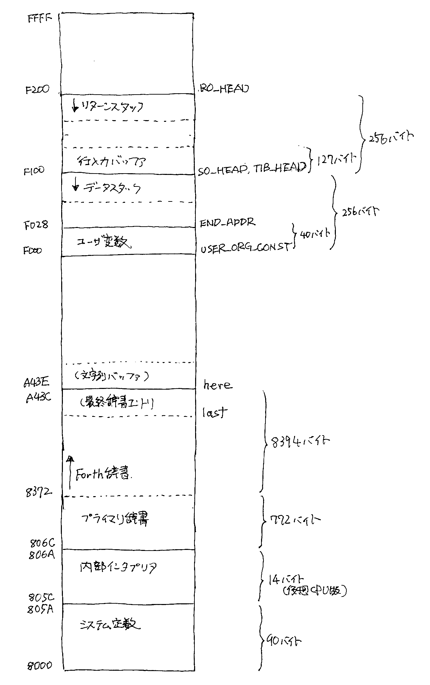

# Design memo

## 内部インタプリタ設計アイディア

内部インタプリタがスレッドコードを実行できるようにして、Forth処理系自体のほぼすべてをスレッドコードとして記述する。

間接コードスレッドとする。コードフィールドは、間接ジャンプのとび先１ワードのみ。CODEワードの場合は、".+2"(現在番地の次のワードへ飛ぶ)、コロン定義の場合は、M_COLON + M_NEXTエントリへ飛ぶ。パラメータフィールドのアドレス列の末尾はSEMIのコードフィールドを指す。

最初に存在するものは、ワードを定義するワードだけである。具体的には、

    @(at-mark) !(exclamation)       # memory operation
    : ; VARIABLE CREATE             # defining words
    + * -                           # alithmetic operations
    HERE ALLOT ,(comma) '(quote)    # dictionary operations
    LITERAL BRA BNZ                 # literal and branchs
    <MARK <RESOLVE >MARK >RESOLVE   # branch operand resolution
    COLON SEMI NEXT RUN             # inner interpreter
    WORD NUMBER FIND EXECUTE        # outer interpreter

これらのワードは全て処理実体をC言語関数として記述する。かつ、1仮想機械語命令1関数で用意する。その1命令だけを実行する辞書エントリを用意する。プライマリワードの誕生である。

> その後、Forth定義ワードを作っていく過程で、プライマリワードの入れ替わりが生じた。完成時点でのプライマリワードは以下の通り
>
> * outer interpreterはC言語版テキストインタプリタの中にまとめてしまった。word, number, find はプライマリワードではなく Forth定義版で用意した。この3つをプライマリとすると、あとでターゲットCPU用処理系を書くときに苦労する。これらをForth版で用意することで、複雑な処理をアセンブリ言語で書く必要がなくなる。
> * 算術演算: 数値出力(`<# ... #>`での計算に必要な倍長整数計算を中心に追加した。
> * 比較演算子: `>` 以外の比較演算子は、`>`, `not`, `=`(これもForthワードで定義できる)の組み合わせでForthワードで定義している。
> * `COLON`, `SEMI`, `NEXT`, `RUN`は、ユーザ変数でアドレスを用意して使っている。辞書エントリを用意していない。
> * `<MARK`, `<RESOLVE`, `>MARK`, `>RESOLVE`はForth版で用意できたので、プライマリワードとしなかった。
> * `bye`: Forth処理系を止めてシェルプロンプトに戻る。
> * `call`: 機械語サブルーチンコール。`does>`定義で使用している。
>
> ```
>    + * - / /mod m*/ m+ u* um*/     # alithmetic operations
>    .ps dd dump lnum                # debug words
>    : ;                             # defining words
>    '(quote) [compile]              # dictionary operations
>    d+ d<                           # double-length
>    dictdump getline emit key outer # i/o operations
>    ?branch branch dolit s_dolit    # literals and branches
>    execute                         # execution
>    xor > and not or                # logical operations
>    halt not trap                   # machine code words
>    @ ! c@ c!                       # memory operation
>    bye call                        # misc
>    swap drop dup exch over rot     # stack operations
>    +rsp >r r> rp! rsp sp! sp@      # stack pointer operations
> ```

実行コンテキストは、以下の要素を持つ構造体とする。

    IP, WA, CA, RS, SP, PC: 16ビットレジスタ

まずここまでで作ってみよう。

 Register|Description  
 |--|--|
 IP|インストラクションレジスタ。現在実行中のセカンダリワードの中で次の命令のアドレスを保持する。
 WA|ワードアドレスレジスタ。現在実行中のキーワードのアドレス、または、現在のキーワードのボディ位置の最初のコードのアドレスを保持する。
 CA|コードアドレスレジスタ。
 RS|リターンスタックレジスタ
 SP|スタックポインタレジスタ
 PC|プロセッサのプログラムカウンタレジスタ

## CODEワードの例

考え直して、必要なCODEワード一つに機械語命令1つを割り当ててみた

> 機械語命令は、当初`c000`から割り当てていたが、ブランチ命令を用意する際に最上位1ビットで命令を識別し、残り15ビットをオペランドとした際に、`c000`開始から`7000`開始に引っ越ししてもらった。

 |word|instruction|description|
 |--|--|--|
 |7001|COLON|IPを保存してWAをIPにmovする
 |7002|NEXT|@IPをWAにmovして、IP +=2する(IPはスレッドの次のワードのアドレスを指す)。
 |7003|RUN|@WAをCAにmovして、WA +=2する。最後にCAをPCにmovする(現ワードCode Area番地にジャンプ(PC移動)する)
 |7004|SEMI|IPをリターンスタックから戻し、スレッドの次のワード実行に移る。

CODEワード定義は以下の通り(big endian)

* code fieldに .+2 を置く(次のワードの機械語から実行開始)
* 機械語の最後は NEXT 命令(スレッドの次のワードの実行)

```
    entry_030:
    e_add:
820a        .head "+"
820e 81fe   .dw   entry_029   // link to previous entry
    do_add:
8210 8212   .dw   .+2   // points 1 word later
8212 7021   m_add       // machine code 'ADD'
8214 fe4e   m_jmp NEXT  // jump t0 8064
```

機械語命令としてのPC手繰りと、スレッド実行としてのIP手繰りを区別する。PC手繰り中はIPは動かない。IPは `docol`,  `next`, `semi`, `branch`, `?branch` で動かす。

## メモリマップ

オールRAM、C言語世界では、`mem_t mem[65536];` で定義した配列を使用する。64k分確保しているが、実際には後半32kB分を使用している。辞書領域を`8000`からとし、ユーザ変数・バッファ類は`F000`からとした。

立ち上げ用初期辞書エントリをバイナリファイル(`8000`番地に)読み込み後、辞書先頭の定数エリアを参照しながらC言語テキストインタプリタ初期化、C言語テキストインタプリタを起動する。

辞書領域は、コロン定義を進めるごとにアドレスの大きい方に大きくなる。テキストインタプリタまでコンパイルし終えた時点で9310バイトを占めている。

```
End: A45E, 245E(9310 ) bytes.
```

<figure>

</figure>

## アセンブラ

辞書生成のためのアセンブラを用意する。

そのアセンブラコードを出力する辞書コンパイラ`makedict.sh`を用意する。narrowroad-m68kから持ってきた。

## 辞書コンパイラ


    word <name>
        ...
        endword

または、

    code <name>
        endcode
    code <puncname> <name>
        endcode

に加えて、

    opcode <name>
    opcose <puncname> <name>

も受け入れる。`opcode`ディレクティブは、仮想機械の機械語1命令を実行するワードを定義する。

今回は、code定義なし、opcode定義でないものはForthコードをコンパイルして辞書を生成する。
`:`, `;`, `VARIABLE`は機械語1命令で、opcodeエントリで定義する。

## アセンブラ

[asxxxx](https://shop-pdp.net/ashtml/)パッケージをざっと眺めてみたが、思っていたより面倒くさそう。命令は表を書けばよさそうだが、オペランド解釈部分のCソースコードが頭に入ってこない。理解して使いこなすまでに時間がかかりそう。おじげついてしまっている。

FORTH用のアセンブラは、

* 各ルーチンのサイズ(命令数)は小さい。
* スレッドコードにアドレスを並べるので、シンボル定義・解決は欲しい。
* 今回の場合、命令数は少ない、1 Forthプリミティブ1命令のレベルなので。
* 機械語エントリ(CODEエントリ)のパラメータフィールドは２命令(対象オペレーションを行う命令1つとNEXT命令の２つ)、なので、
* 機械語ルーチン内で分岐はない、多分。

なので、シンボル定義・解決と、命令名から1ワード生成するawkスクリプトでいいだろう。

* シンボル操作は連想配列を用いる。2パス方式。1パス目でアドレス勘定・コード生成ののち、
そのファイルに対して2パス目を掛ける。
* 辞書ヘッダ生成、リンク生成のマクロを用意する(narrowroad-m68kで使ったものが使えるはず)

### アセンブラのディレクティブ

 |directive|description|
 |--|--|
 .head|ヘッダ文字列を生成する。ワード境界でそろえる。<br>後ろに空白最低1文字置く。奇数文字の場合2バイト空白ということ。<br>先頭1バイトは文字列長さだが、上位3ビットはフラグ。<br>MSBがprecedence/即値ワードを示す。
 .dw|ワード定数。スレッドコードのコンパイル、リンクアドレス置きに使う。
 m_xxxx|機械語命令、`machine_code`関数のswitch文に対応コードが置かれている。
 .org|開始アドレスを指定する。

ターゲットCPU用のコードを書く際には、`asxxxx`を使うつもりである。この場合、上記`.head`ディレクティブを`.db, .dw`に変換するスクリプトを用意して、アセンブルの前処理を行わせる。

