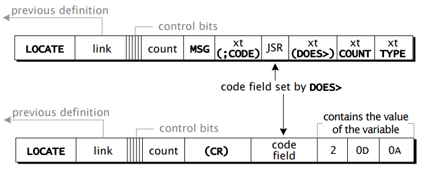

# cpnr実装メモ

cpnr(A C Portable narrowroad interpreter)設計・実装の過程を記録し、C104同人誌ネタを集積する。

## 1プリミティブ1命令の仮想CPU

仮想CPUなので、PC, SPはじめForth処理系に必要なレジスタを持ち、PCをインクリメントしながら、「機械語命令」をフェッチ実行するエミュレータを作る。

最初はTILの仮想CPUの命令をそのまま実現しようかと思ったが、ソフトCPUなので、機械語のビットパターン構成を持つ必要はない。ビットパターン構成はハードウェア上の制約によるからである。

また、メモリとレジスタ間の転送もこだわらなくてよい。スタック経由でのデータのやり取りがメインなので。

ここまで考えて、**Forth1ワードを1機械語命令**としてもよいのではないかと思いつく。こうすることで、プリミティブはすべて、2命令(プリミティブを構成する命令一つとNEXT命令の2つ)で実現できる。

各機械語命令はC言語で記述できる。加算減算プッシュdropのような単純なワードも、`ACCEPT`(行入力)、`WORD`(空白文字でワードを切り出す)、`FIND`(ワード文字列で辞書を検索し、定義の有無を探す)、`NUMBER`(ワードをバイナリ数値に変換する)もすべてC言語で記述できる。

最初はC言語多めでForth処理系を作り上げてから、C言語部分をスレッドコード化(コロン定義化)して減らしてゆく際も、プリミティブ単位でスレッドコード化すればよく、移行の管理もやりやすい。

機械語命令化するワードを以後、プリミティブと呼ぶ。プリミティブは2種類ある。最後までプリミティブのままのワードと、最初はC言語命令だが、最終的にはコロン定義で置き換えられるものである。

#### 最終的にプリミティブのままのもの

他の実CPUに移植する際にはターゲットCPUの機械語命令で表現することになるもの。

1. 内部インタプリタ(NEXT,RUN,COLON,SEMI,EXECUTE)  
2. 加減乗除・ビット演算
3. スタック操作(PUSH,DROP,ROT, ...)
4. メモリアクセス(!, @, C!, C@)
5. 文字列処理(.")、メモリ転送(CMOVE, ...)
6. 出力処理(# #S <# #> ...)、入力(KEY, ?KEY)
7. アボート(ABORT)...大域ジャンプ機能、C言語でsetjmp/longjmn使う部分

#### 最終的にスレッドコード化するもの

コロン定義で再定義される。ターゲットCPUに「移植」せずともそのまま利用可能となる。

5. コロン定義(コロン、セミコロン、IMMEDIATE)
7. 定義語(CREATE, VARIABLE, CONSTANT)、
6. 制御構造(IF ELSE THEN, DO WHILE, ...)
8. 外部インタプリタを構成する単語(ACCEPT, WORD, FIND, NUMBER)
9. 外部インタプリタ自身(QUIT)

## 外部インタプリタ、内部インタプリタ、仮想CPU

外部インタプリタは当初C言語で記述する。ACCEPT, WORD, FIND, NUMBERに相当する処理をC言語で記述し、外部インタプリタはそれらを使ってループを構成する。

コードを書きながら感触を見て組んだ結果として、

    monitor ⇒ 外部インタプリタ ⇒ EXECUTION 
    ⇒ 仮想CPU実行 ⇒ debugger

とした、仮想CPU起動の前処理として辞書検索して得たxt(Execution Token)をスタックに載せておいてEXECUTEプリミティブのコード部のアドレスをPCに入れた状態で仮想CPU実行を開始する。

簡単なプリミティブなら1命令実行後NEXTを実行して終わる。複雑なプリミティブならそれなりにスタック操作したりする。スレッドコード部分なら、COLON命令のあとスレッドを構成する各ワードを実行し最後にSEMIを実行して呼び出し元に戻る。

最上位はmonitorである。基本的にrun命令`...`(ピリオド3つ)しか受理しない。実ハードではコンパニオンCPU内部のプログラムとなることを想定している。シリアルのダウンロード、ブレークポイントの設定機能が入る予定。

外部インタプリタ内部ではC言語記述の処理を実行し、最終的には辞書上のコードをスタックに積んだ状態で仮想CPUが動き始める。

仮想CPU内部では、命令のフェッチ・実行の合間にブレークポイント(予め登録しておいた仮想マシンアドレスとPCを比較し、同じであれば停止する)、HALT機械語命令を実行したところでいったん仮想CPU実行(do_machine)を終了し戻る。C言語記述の外部インタプリタは、次の実行サイクルを開始し、WORD/ACCEPTの実行から始める。

## 最初の立ち上げ

* monitor, 外部インタプリタ, EXECUTION, 仮想CPU実行,はそれなりに組んでおく。
* 仮想CPU実行は常時シングルステップとして、デバッガを呼び出す。
* デバッガは仮想CPUレジスタダンプとスタックダンプのあと、キー入力待ちとなる。キー入力するとデバッグを抜け、次の機械語命令実行に回る。
* 外部インタプリタ最初はWORDとEXECUTEのみを実装する。NUMBERはスタブ、FINDは常にテストワードのxtを返すスタブとする。
* 辞書エントリは1種類テストワードのみ、機械語命令を複数並べ、最後にNEXTを置く。

## WORD

WORDプリミティブのコードをC言語で書いている。入力ストリームの定義と設計が問題になった。

* `WORD`が現在読み込んでいる文字は`BLK`, `>IN`の2変数で決まる。
  + `BLK` == 0ならメッセージバッファ`S0`中のオフセット`>IN`の文字
  + `BLK` != 0なら、`BLK BLOCK >IN @ +`の位置の文字。`BLK`はブロック番号を保持する変数。`BLOCK`でブロックバッファ上に該ブロックの内容を読み込み、ブロックバッファ先頭のアドレスを返す。そこにオフセット`>IN`を足したアドレスがカレントポインタとなる。

この場合、入力メッセージバッファ`S0`(データスタック最後尾の次、昔のForthではデータスタックのすぐ上位に入力メッセージバッファを置いた)の有効長、ブロックバッファの残り文字数が明示的に表れてこない、がこれは必ず必要になる。何らかのシステム関数(例えば`getchar`)の内部で管理するのが適切だろう。末尾に達したらEOFを返す。Forthの場合は、バイト0を返すというのでよさそうだ。

EOFを返した時に入力ストリームを再初期化する必要がある。以前のnarrowroad-m68kでは`getchar`内部で行おうとしていたが、これは外に出した方がよさそうだ。

ロジックは「EOFが来たらキー入力を入力メッセージバッファに読み込み`>IN`をゼロに、残り長さを`getchar`内部管理の変数にセットする」とする。

ブロックバッファからソースコードを読み込んで解釈実行するのが`LOAD`であるが、これは入れ子で呼び出される。あるブロックの解釈が終わると、`LOAD`コマンドの次に実行を移す。とすると、`LOAD`のネスティングを管理せねばならないが、さてどうするか？

データスタック上でネスティングを管理することが可能かどうかよくわからない。ブロック間でデータスタックにものを置かないルールを課せばなんとかなるかもしれない。

個人的にはブロックバッファは使うつもりがないので、初期立上では内部バッファを読み切ったらキー入力としましょう。あと、`S0`と`PAD`はHERE+36byteと。

内部バッファ、エミュレータではファイル引数を読み込んで入力ストリームにつなぐ、実機ではFLASH領域のアドレス。

ACCEPTが、EOFが返ったあとのリダイレクト(`getchar`が次のデータを読み込めるようにする)。

プロンプトは、キー入力の入力バッファすべてを読み切って空になったときにその行に出す。OK出して改行、ユーザ入力は次の行の先頭から見える。となっているようだ。

## FIND

 FINDの動作を確認するためには、辞書のバイナリイメージが必要である。辞書ファイルをアセンブリ言語に変換し、アセンブラ(*.s)とバイナリダンプ(*.Xファイル生成)ツールを作成した。

 辞書には、コードワード、しかも1機械語命令だけを含むコードワードを入れた。これを用いてC言語で外部インタプリタを作成し、ソースコードをコンパイルしてコロンワード(スレッドコード)を生成できるようにする。これが次の目標である。

 辞書エントリのリンクをたどって文字列比較するところは平明だった。strncmpが使えることは見通しの良さを得た。

 xt, 実行トークンの定義で迷った。辞書エントリのコードフィールドのアドレスを含むワードなのか、それともその中身のワード(そこに間接ジャンプする)のかである。結局TIL本の例のコードを見返した。

    Location   Mnemonic Instruction  Comment  

    0140       COLON   PSH I -> RS  
    0142               WA -> I  
    0144               JMP         ; Jump to NEXT  
    0146               0104          

    0100       SEMI    0102        ; Code address of SEMI  
    0102               POP RS -> I  
    0104       NEXT    @I -> WA  
    0106               I = I + 2  
    0108       RUN     @WA -> CA  
    01OA               WA = WA + 2  
    010C               CA -> PC  

    0050               7E          ; Dictionary  
    0052               XE          ; header  
    0054               LA          ; for EXECUTE  
    0056       EXECUTE 0058        ; Code address of  EXECUTE  
    0058               POP SP -> WA
    005A               JMP         ; Jump to RUN
    005C               0108  

`EXECUTE`のところ、スタックトップのワードの値は、RUNの先頭でそのアドレスを取り出しそこにジャンプする。つまり、辞書エントリのコードアドレスをスタックに積めばよいことが分かる。

    STAR(code_addr(entry));

ではなく、

    code_addr(entry);

をスタックに積めばよい。

## RUNが違うのではないか?→やっぱり違わない！

do_executeが最初動かなかった。1回余分にポインタを手繰ってしまっていた。

xtが次に実行するワードのコードフィールドなので、１ワード実行後、次のワードhaltをスレッドコード的に実行させようと考えた。それで、xtをipに入れたらよいと思っていた。

ユーザ変数HALTにxtを置くようにしていたので、ユーザ変数HALTの値をipに入れればよいのだろう。

        cx->ip = STAR(HALT_ADDR);

と考えたのだが、これで実行すると、機械語先頭をアドレスとしてフェッチ後飛び込んでしまった。

もう1回、スレッドコード実例も見ながら考え直した結果、「ipは、次に実行するワードのコードフィールドを指すアドレスを置いた場所を指している」のだった。

今の場合、たまたま、ユーザ変数HALTにxtを置いており、その置き場のアドレス、つまり、HALT_ADDRをipに入れればよいのだ。STARででレファレンスするのではなく、HALT_ADDRを直接ipに入れておく。内部インタプリタNEXTでは、IPの指す先にある「次のワードのCAのアドレス」を取り出して、その指す先にジャンプするので動作する。最初、TILの記述が間違っていると思ったのだが、そんなわけはない。間違っていたのは、私のdo_executeの作り方だった。久々に「mallocにバグ無し」という名言を思い出したことだった。

    void do_execute (context_t *cx)
    {
        // start inter interpreter
        cx->wa = do_pop(cx);
        // code of m_run(cx);
        cx->ca = STAR(cx->wa);
        cx->wa += 2;
        cx->pc = cx->ca;
        cx->ip = HALT_ADDR;
             // ipはxtの置き場を指すようにする。
             // それはアドレスHALT_ADDRだ。
        // do infinite loop
        do_machine(cx);
    }

do_machineはm_halt命令を実行するとdo_machne内の無限ループを抜けて戻ってくる。ワード"halt"(機械語命令m_haltだけを実行する)を定義して、そのコードフィールドアドレスをユーザ変数HALTに入れてあるので、これで動作する。

    1016 04     .head "halt"
    1017 68
    1018 61
    1019 6C
    101A 74
    101B 20
    101C 1008     .dw    entry_000
    101E 1020     .dw     .+2
    1020 C001     m_halt
    1022 C003     m_next

ユーザ変数HALTの値置き場のアドレスは、400A番地(マクロHALT_ADDR)である。ここには101Eが入っている。

    IP:400A番地の内容(101E)をWAに代入
    WA:101E番地の内容(1020)をCAに代入
    CA:1020番地にジャンプ(== CAをPCにmoveする)

とNEXTは動作する。

これで内部インタプリタも動作することが分かった。コロン定義を実行させて初めて完結するが、最後のEXIT以外は大丈夫そうだ。

次はコロン定義が書けるようにする。':', ';'を定義するが、その前にCREATEを用意する。

コロン定義が書けるようにすると、C言語1命令1プリミティブの用意は終わり、いよいよコロン定義だけを用いてForth処理系を書きおろしてゆく。

## コロン定義のコンパイル

コンパイルを実現するために必要な処理は3つある。

* ワード2個、コロンとセミコロン
* mainloop(外部インタプリタ)の「ワード実行」を「コンパイル」に切り替える
* 即時ワード(IMMEDIATE)処理

## ワード実行とコンパイルの切り替え

これは変数`STATE`の値により切り替える。変数名を明示的に書くことはなく、`[`, `]`の定義中で参照・書き換えるようである。我々は`[`、 `]`をプリミティブ(機械語)とするので、内部インタプリタ内部とこの両ワード定義内で参照できればよいということになる。

内部インタプリタも`[`、 `]`もコロン定義するつもりなので、ユーザ変数を定義する。コロン定義中では、`_state`でアドレスを返すワードとしてプリミティブを用意し、以後、それを使用する。

プリミティブとしては、コロン、セミコロン内部で切り替えるところで始める。`[`、 `]`, ワード`STATE`はコロン定義でつくる。実体としてユーザ変数_STATE(アドレスSTATE_ADDR)を用意する。

## :(コロン)と;(セミコロン)

コロン定義では、do_createした後にSTATE_ADDRに1を書き込むだけである。

セミコロン定義では、SEMIの実行トークン(xt)を辞書エントリに追加した後でSTATE_ADDRに0を書き込む。

SEMIの実行トークンは起動時に変数SEMI_ADDRに入れておく。

## 内部インタプリタが動作しない

プリミティブ(opcodeのC言語記述)の間違いが多かった。

* opcodeが動作しない。これは機械語(do_machine)の誤り
* opcodeエントリの最初で機械語命令に飛ばない。
* 飛んでも停止しない...executeの戻り先に「機械語ルーチン」ではなく、「機械語ルーチンのアドレスを入れた場所」をIPに入れておかねばならなかった。

今回良かったのは、COLON, SEMI, NEXT, RUNの機械語命令をTILに記載のものがあり、迷ったらそれに立ち返ることで方向を見失わなかったことだった。辞書エントリのコードフィールドのアドレスは「機械語ルーチン」のアドレスだが、コロン定義の2番目以後のアドレスは、「ワードのコードフィールド」であること。これを見失って道に迷いかけた。narrowroad-68kではここを自分だけで考えて道を踏み外し、気が付けば直接スレッドになってしまっていた。今回も、executeで実行できないとき、「アドレスを機械語命令として実行しようとした」ため、NEXT, RUNのでレファレンスを外しかけてしまった。TILのコードを前に頭を冷やして対応することで間接スレッドで完遂することができた。

要点は、
* 辞書エントリのコードフィールドのアドレスは「機械語ルーチン」のアドレスだが、
* コロン定義の2番目以後のアドレスは、「ワードのコードフィールド」であること。  
  この先のワードをフェッチして、そこにジャンプするのだ。
* xt(execution token)は「ワードのコードフィールドのアドレス」であること。

コロン定義の最初のアドレス(コードフィールド)と２番目以後のアドレス(パラメータフィールド)は意味が違うのだ。本で何度も見ているこの文言だが、いざ自分でコードを書きデバッグすると簡単に道を失ってしまうことを体験できたのは収穫だった。

## コードフィールドに入れるルーチンアドレス

当初、opcodeとして、COLON, NEXT, RUNのコードワードを定義して、辞書ロード後にこの３ワードのxtをdo_findで見つけて、それをユーザ変数に代入していた。あとでコンパイルの際に、新しいワードのコードフィールドに書き込むためである。

新しいコードフィールドに書き込むアドレスはこれではいけない。これはdo_findで当たったアドレスを入れてはいけない。この3ルーチンは機械語ルーチンとしてワードエントリとは別物として扱うべき。

C言語版Forth処理系としては、辞書の中にこれら機械語ルーチンも含めておきたい。辞書バイナリと一体化して、バイナリロード１回で済ませたいからである。辞書バイナリは、最初3ワードが辞書エントリのとりつき口(LAST, H/HERE)としている以外はすべてエントリの列である。

EXECUTEはxtを用いて起動するので、辞書エントリだけしか呼び出せないと考える。定義語の定義でコンパイル時にCREATEの後にコードフィールドに書くアドレスにも要注意。DOES>の後ろのコードを実行させたいのだが、ここがトークンスレッドなので、m_colon命令を置いてそこを指すようにする必要がある。

NEXT,RUNを分けているのはそれが理由かもしれないという気がしてきた。定義語で新しいワードを作ると、そのワードのCFAにはm_colonを置いた場所のアドレスを置くが、その中でIPをIP+2してはいけない。スレッドコードは別の場所(おそらく、元の定義語のパラメータフィールド後半)にあるからである。m_colonとは別の機械語ルーチンが必要そうだ。

改めてみていると、そうでもないか。EXECUTEはNEXTを呼び出さずにRUNを呼び出している。あー、これはスレッドコード中から呼び出すからかな。RUNは間接参照ジャンプで、WAがCFAを指すアドレスを保持している前提で作られている。NEXTは、このCFAアドレスをIPの先から得る。すなわちスレッドコードの実行なのである。EXECUTEはスタック上からxtを得るからこうなっているのだろう。また、スレッドコード中にEXECUTEを含めることができるように、EXECUTEのアドレス自体には .+2の定数が置かれている。これはコードワードのCFAに置かれているものと同じ。

ちょっとわかってきたかな。

* NEXT: スレッドコードの次のトークンの実行(IPの先からxtをフェッチして、IPポストインプリメントしつつxtにジャンプ(==RUNと同じ))
* RUN: 機械語的間接ジャンプ(xtアドレスをWAに入れて飛び込む)
* COLON: IPをリターンスタックにプッシュして、新スレッドコードの先頭をIPに入れてNEXTへ
* SEMI: リターンスタックからIPに戻してNEXTへ

機械語ワードの最後はEXITと呼ぶが、これは、(機械語ルーチンの中で使わなかった)IPをWAに入れてRUNだな。こうして書き下してみれば単純明快なのだが、1度では肌になじまないのがこわいところ。今後のターゲットCPUの移植でまたハマるだろうがやむを得ないな。この原則を見返して道を踏み外さないようにしよう。

TILの仮想CPUでWA, CAレジスタがあるのが面白い。おそらく、CFAに置かれたルーチン(COLON==doLIST, doVAR, doCONSなど)は自分のパラメータフィールドを知るのだろう。WAが+2されているので、パラメータフィールドのアドレスはWAが保持している。doVAR, doCONSで変数の置き場所はここから知ることになりそうだ。

## 整理

内部インタプリタで整理する。

* word_mem(addr) -> STAR(addr)と改名した。ターゲットメモリのaddrの値を取ってくるのだが、星なので左辺値でもあり、STAR(addr)に代入できる。ワード単位の処理。ちなみにバイト単位の処理では、mem[addr]がそれに相当する。バイト実ポインタの取得も &mem[addr]と書く。今のところ、ワード実ポインタを得てバリバリワード配列処理をすることにはなっていない。

* :(colon), ;(semicolon)と、メモリpeek, poke (C@, C!, @, !)と加減乗除が少々あれば、インタプリタは全部かけるんじゃないかという気がしているが、ひとつ欲しいものがある。それは `DOES>`である。これは定義ワードで用いられる。コンパイル時にエントリを作る際の挙動だけでなく、出来上がったワードを実行するときの挙動も記述できるというものである。変数、定数、配列などもこれがあれば構成することができる。

## `DOES>`

    : FOO CREATE ..(1).. DOES ..(2).. ;

と書く。(1)部分が通常のコロン定義同様に、FOOの定義、FOOを呼び出したときに実行する内容である。FOOを使うときは、

    1 2 FOO BAR

のように描き、FOOの前の1 2がパラメータ((1)で使われるものもあれば、(2)で使われるものもある)で、FOOはそれを解釈してワードBARを作る。ワードBARを実行すると、そのたびに(2)の部分が実行される。

例えば、変数を定義するVARIABLEは、

    : VARIABLE CREATE ..(1).. DOES> ..(2).. ;

ある変数ZOTを定義するときは、

    VARIABLE ZOT

と書く。これでワードサイズの変数ZOTができる。

(1)の部分で、ZOTの中を作り、(2)の部分はZOTを呼び出したとき(使うとき)実行されるコードを決める。

変数の仕事は、

* 変数ZOTの値を確保する場所はパラメータフィールドである。
* ZOTを呼び出すと格納場所(パラメータフィールドのアドレス)を返す。

これだけである。参照と代入は@, !を用いる。

## `DOES>`の実装

コンパイル時動作と実行時動作を持つ定義ワードの構成方法。Forth Programmming Handbook に記載がある。以下示す。



> 1. コンパイラは `DOES>`を実行します。`DOES>`のコンパイル時の動作は、定義される新しいワード(`DOES>`を含む定義ワードのインスタンス)のコードフィールドを設定するコードをコンパイルして、`(;CODE)`のコンパイルされたアドレスに続くセルを指すようにすることです。
> 2. `(;CODE)`のアドレスの後、`DOES>`は `DOES>`のランタイムコードへのサブルーチン呼び出しをコンパイルします。その後、コンパイラは新しい定義ワードのアドレスのコンパイルを終了します。(定義ワードのサブルーチン呼び出しの使用はシステムに依存します。しかし、`DOES>`のすべての実装は、定義ワードのデータ空間アドレスを失うことなく、`DOES>`のランタイムコードが定義ワードの高レベルコードを見つけられるように、定義ワードに何かをコンパイルします)。新しい定義ワードが実行されるとき、その最後のステップは、それが作成するエントリの実行トークンを、定義ワードの `DOES>`によって作成されたジャンプ・ツー・サブルーチンを指すように変更することです。
> 3. 新しい定義ワードによって作成されたインスタンスの 1 つが実行されると、仮想マシンは定義ワードのサブルーチン呼び出しにジャンプします。次に、サブルーチンコールは、CPU に依存する何らかの方法で、それ自体に続くセルのアドレスを保存し、`DOES>`の実行時コードにジャンプします。このコードは、サブルーチンリンケージからのアドレスを使って、定義ワードの実行トークンを見つけます。`DOES>`の実行時コードはまた、定義ワードのパラメータフィールドのアドレスをデータスタックにプッシュします。

`(CR)`のコードフィールドには、「スレッドコードを実行するルーチン」のアドレスが置かれる。スレッドコードを実行するルーチンなのだから、`COLON`に限りなく違いが、実行対象が、自ワードのパラメータフィールドではなく、元の定義ワードの`DOES>`の後ろ側という違いがある。

スタックトップにはワード`(CR)`のパラメータフィールドアドレスが置かれている。その前提で`DOES>`の後ろのスレッドが描かれている(`COUNT` `TYPE` の印字対象は`(CR)`のパラメータフィールドである 2 0D DAである)

```
1420 03     .head "MSG"
1421 4E
1422 54
1423 47
1424 20
1425 20
1426 XXYY   link
1428 XXXX   doList
142A XXXX   create
142C XXXX   dodoes  // (CR)コンパイル時の動作の終了
                    // 1428を(CR)のコードフィールドに書き込む
                    // SEMIをコンパイルして(CR)のエントリを締める
            doexit  // MSGのスレッドコードの終了
1428 142A   .+2     // code field (以下の機械語コードを実行)
142A C040   m_does  // DOES>の最初、
                    // WAを保存する(CR)のパラメータフィールドを
                    // 指しているので
                    // WAを使わずにdoLIST相当の処理を行う
                    // IPをリターンスタックに保存し、
                    // WAに142Cを入れてNEXTへジャンプする
                    // --> スレッドコード実行が始まる
142C XXXX   COUNT
142E XXXX   TYPE
1430 XXXX   exit
```

`DOES>`は即時ワードで、

* ワード`dodoes`をコンパイルする。
  + ワード`dodoes`は、
    * 生成中のワードのコードフィールドに1428を書き込む
    * 生成中のワードに`doexit`をコンパイルして締める
* ワード`doexit(or SEMI)`をコンパイルする
* .+2 をコンパイルする
* 機械語命令`m_does`をコンパイルする

以後の COUNT, TYPE, exitは通常のコンパイル処理で生成される。特に配慮は不要。

## 最小opcode

消しまくってERRORが出なくなるまで復活させる。

## base.f 作成スタート

ForthでForthシステムを書く、を開始した。Forthで必要なワードをopcodeで提供されるプリミティブを使い記述してゆく。

* 定数。メモリマップ、セルサイズCELLS, ユーザ変数(LAST, H, S0, STATE, BASE, HALT, COLON, SEMI, LITERAL, DOCONS)
  + LAST, H, S0, STATE, BASE: Forthプログラムの定番、外部インタプリタとコンパイル機能作成時に使う。
  + here, allot, last, immediate, `,`(comma)はこれを使い作成できた。
  + HALT, ワードhaltのxtを格納する、コンパイルで必要
  + COLON, SEMI, LITERAL, DOCONS: コンパイルに辞書エントリ(スレッドコードのリスト)に書き込む際に用いる。毎回文字列から辞書引くのもあれなので、それぞれユーザ変数にxt(またはコードフィールドに書き込むアドレス)を保持しておく。
* 制御構造
  + `<mark`, `<resolve`, `>mark`, `>resolvc`: 制御構造のジャンプ(スレッドリスト内での前後移動のオペランド書き込みに用いる。
  + if-then-else: mark/resolveワードを作っておけば、以前作ったこともありスムーズに動作させることができた。
  + do ... loop: これは難儀した、以下、記録を残しておく。

## do ... loop の作成

リターンスタックにループ変数を取る。末尾のループで、ループ変数の値とリミット値を比較して回るか抜けるかを決める。コンパイル時に、loop内部のジャンプ命令のオペランドを算出する。`<mark`, `<resolve`を doの定義、loopの定義で使う。

do ... loop はあるワードの定義中で使用する。そのワードのコンパイル中に

* do, i, loopの処理(i: ループ変数の値をスタックに載せる, loop:回るか抜けるか決める, 終了時のリターンスタック/データスタック後始末)を行うワードをコンパイルする。
* loop末尾からdoの次へのジャンプ命令とオペランドのコンパイル。オペランド計算をここで行うのも当然だが。

* ターゲットワードのコンパイル中に do, i, loop のxtをコンパイルしてしまうと、オペランド計算ができない。それだけはコンパイル中に「実行」する必要がある。
* do, loopでは、`<mark`, `<resolve`だけを実行し、他の xtをコンパイルする。
* iはとりあえずxtコンパイルでよいだろう。
* do, loopは即値属性を付けてコンパイル中に実行することとせざるを得ない。これで`<mark`, `<resolve`は実行できるが、これ以外のワード、リテラルはすべて「手でコンパイル」しなければならない。
* 手でコンパイル: `literal foo ,`がすべてのワードfooについて書き下ろす。これは大変面倒くさい。

do, loopを他のワードで書く方法はすでにあるはず。それを探してみる。

## do ... loop の実装例

eForthあたりかな。eForthは`FOR...NEXT`(NEXTはR@をデクリメントして0になれば抜ける)を使い、`DO...LOOP`系はない。

ふと思いついたのだが、ワード`(loop)`

    (loop) (limit iaddr index delta)

を作ればよさそう。limitはDO呼び出し前に置いたものをそのまま使う。LOOP系の中で、delta, index-addr (RSPを置く) を(実行時生成するようなコードをコンパイルして)、(loop)をターゲットワードにコンパイルする、その後ろに `compile jz <resolve`(jzをコンパイルしてオペランドを解決)すればよい。

    : (loop)         \ ( limit limit iaddr index delta -- limit flag )
        +            \ limit limit iaddr i+d
        dup rot      \ limit limit i+d i+d iaddr
        !            \ limit limit i+d
        swap >       \ (limit -1) if i+d > limit, (limit 0) if i+d <= limit 
        \ falling down to jz
        ;

    : loop  \ limit -- limit if loop remains | none if loop exits)
        compile dup         \ limit limit
        compile rsp         \ limit limit iaddr
        compile dup         \ limit limit iaddr iaddr
        compile @           \ limit limit iaddr index
        compile literal
        1 here ! cells allot   \ compile 1 as delta)
                            \ limit limit iaddr index 1 
        compile (loop)      \ limit -1|0
        compile jz
        <resolve
        compile r>          \ limit tors
        compile drop
        compile drop        \ discard index (at rsp) and limit
        ; immediate

かなり遅そう。C言語プリミティブで書いた方がよさそう。

## do ... loop デバッグ

かなり苦労した。がなんとかできた。

    : aho 3 1 do i . loop ;

が動くようになった。ちなみに

    : aho 3 1 do i loop ;

は動かない。loopに入るときは、doを出たときと同じスタックレベル(tosが 3)である必要があるためである。

* `do`, `loop`は、`<mark`, `<resolve` を呼び出し元ワードコンパイル時に実行せねばならないので、コンパイルしてしまってはいけない。これのために即値ワードにせねばならない。これ以外のワードはすべて`compile`を前に置く。
* `compile` は後ろのトークンをHに書き込む
* `r>`, `>r` は、rstackのpeekではなく、pushr/poprする。

## 即時ワードの実行の様子

即時ワードは、他のワードの定義中に実行される。COMPILEを使うとき、他のワードの定義に実行トークンを足してゆく。この時内部インタプリタが実行の主体である。一方で即時ワード自身の定義は、外部インタプリタがワード文字列から実行トークンを探し出して書き込んでゆく。

loopの定義では、前処理と後処理の間に jzワードを置かねばならない。jzワードを置いた次に`<resolve`を(他のワードのコンパイル中に)「実行」せねばならないので、loop自体を即時ワードとせねばならない。なんとなれば、ワードloopの実行トークンがターゲットワードのスレッド内に置かれてしまい、そのスレッドの中で実行したい`<resolve`が現れてこない。

`<resolve`以外のワードはすべて、ターゲットワード実行時に実行されるようにするために、それらワード全ての前に`compile`が置かれる。非常に見苦しい形になる。`if`, `eise`, `then`なら2ワード3ワードなので単純明快だが、`loop`のように10ワード以上も並ぶと分かりにくい。

`loop`１ワードだけをコンパイルし、かつ、条件付きジャンプを実現する方法として、`loop`の後ろに飛び先オペランドを置く、`loop`をオペランド付きワードとする方法もある。

今回は素直にcompile地獄で固めた。

## do ... loop 作り直し

最初のバージョンでは、limitをデータスタックに残し、indexだけをリターンスタックに置いていた。Forth79を見ると、limit, indexの2つともリターンスタックに置いてもよい、置くのが普通だ、と言っているように見えた。

> loop-sys: loop control parameters.  These include implementation-dependent representations of the current value of the loop index, its upper limit, and a pointer to a termination location where execution continues following an exit from the loop.

私の実装では、loop control parametersをリターンスタックに置いている。なので、limitもまとめておいても良さそうなので。

終端点のポインタもあり得るというのは面白い。上で書いたように、コンパイル中のスレッドコードでloopの次の位置を指す場所を使うこともありだろう。今回は、loopは即時ワードとして`<resolve`でブランチワードのオペランドを計算させているので不要だが、そういう手もあるとは考えていたし、実際に使うことがあると分かったのは収穫だった。

制御構造は

    if ... then
    if ... else ... then
    do ... loop
    begin ... until
    begin ... while ... repeat

まで作った。次に何を作るか。

## DOES> ... 定義語を定義できるようにしよう

定義語を定義するときは、

* 定義語を定義するときの手続き
* 新しくできた個々の定義語が実行されるときの手続き

の2種類があり、それをコロン定義するための仕掛けが `DOES>`である。

    : foo create ..(a).. does> ..(b).. ;

(a)の部分が foo xxx で xxxを定義するときに実行する処理で、(b)の部分が出来上がった xxx を実行するときの処理である。

例えば定義語 variable の場合、

    variable xxx

(a): 辞書上に名前xxxを持つエントリヘッドを作成し、1ワード分の空きを作る。  
(b): 1ワード分の空き(パラメータフィールド)のアドレスをスタックに積んで帰る。

である。

    : variable
        create cells allot
        does> ;

(b)部分のコードに入ってくる時点でスタックトップにパラメータフィールドのアドレスがプッシュされているので、does> 節で何も書かなくてよいとなっている。

entry_123:
    .head "variable"
    .link entry_122
    .dw   do_colon
    .dw   do_create
    .
    .(a)
    .
    // DOES> part
    .dw   do_does
    .dw   do_semi        // end of part (a)
does_execpart:
    .dw   do_colon
    .
    .(b)
    .
    .dw   do_semi

does>は即時ワードで、do_does, do_semi, do_colonを(その定義語のスレッドに)コンパイルする。

do_doesは、その定義語の実行時にターゲットワードのコンパイル処理を行う。

* ターゲットワードの code fieldに、does_execpartアドレスを格納する

例えば、定数定義語 constantは、

    : constant
        create , does> @ ;

と書けるため、create の後、hはコードフィールドをスキップしてパラメータフィールドまで進めておく必要がある。

## `DOES>`: 設計とデバッグ

これも非常に難航した。文献で参考となるソースコードが見つからなかったので、仕様をさぐりながらのデバッグとなった。

例えば、定数を定義する定義ワード`constant`は、通常、以下の定義となる。

    : constant create ..(a).. does> ..(b).. ;

これを使って定数ワード`foo`を定義するときは、

    100 constant foo

ワード`foo`の辞書エントリを構築する際は、(a)パートに従い構築される。`foo`を実行するときは、(b)パートのスレッドコードを実行する。

* `constant`の辞書エントリは、通常のコロン定義のコンパイルにより作成される。
* `100 constant foo`により`constant`が実行されるときは、
  + `create`により辞書エントリヘッダが作られ、
  + 後ろに(a)パートのコンパイル、
  + `does>`の処理(コンパイル又は実行)、
  + (b)パートのコンパイルとなる。

* `constant`のスレッドコードは下記の1886以後のワード列である。`does>`を境に、(a)パートの終端処理(semi)を置き、(b)パートの先頭の処理を組み立てるので、`does>`は即時ワードとして、その中で`compile semi`(実際は `SEMI_ADDR @ here !`)、`compile colon`(これも実際は`COLON_ADDR @ here !`)を含めておく。

    1878 .head [constant]
    1882 1850  [link]
    1884 1030  [code]
    1886 17ee ..(a)パート
    1888 14ea ..
    188a 1838 ((does))
    188c 103c (semi)
    188e c039 m_startdoes   // 機械語命令、ワードfooのコードフィールドが
                            // このアドレスを指している。
    1890 1030 (colon)
    1892 10be ..(b)パート
    1894 103c (semi)  

* (b)パートは、`foo`だけでなく、`constant`により定義されるワード全てで実行される。よって、個々のワードにスレッドコードのコピーを置くのではなく、`constant`の辞書エントリ中にコンパイルされた部分を皆共通で実行できるようにしたい。
* `foo`のコードフィールドは、(b)パートを指すアドレスを入れる。ここに先頭の`colon`を指すアドレス(上記の例で1890)を格納してもうまくいかない。この位置にはアドレスでなく、機械語命令を置く必要がある。
* 仮想機械語命令`m_startdoes`を新設した。この中で1890以後のスレッドコードを実行する準備をする。
* これまでのIPを保存する必要があるので、`colon`を最初に置く。通常のワード定義と同じようにする。
* 1892以後の(b)パートと、最後の`semi`は`constant`自体のコンパイルの流れで生成される。`does>`でこの部分に関与しない。というか、その流れを利用してそのまま使うようにする。

    1896 .head [foo]
    189c 1878  [link]
    189e 188e  [code]   ; `constant`ワード定義の`m_startdoes`命令を指すアドレス
    18a0 0064           ; 定数100はここ、パラメータフィールドに置かれる。

* `constant`が定義したワード`foo`のバイナリを示した。パラメータフィールドにはスレッドコードはなく、ただ定数1ワード置き場だけが確保されている。
* コードフィールドには、`constant`定義の(b)パートを実行するアドレスを格納する。`colon`を指すアドレスを入れてみたが動作しない。`foo`のコードフィールドの先は機械語命令を指さねばならないのだが、`colon`で、次に実行するスレッドコードの先頭はWAレジスタに入れて渡すのだが、`foo`から飛ぶ際にはWAレジスタには`foo`のパラメータフィールドの先頭を指している。ここは`does>`の(b)パートを指すようにしなければならない。

なんらかの繋ぎ処理を機械語命令で行う必要がある。よって、新しい命令`m_startdoes`を作成した。

    case 57: // m_startdoes
        do_push(cx, cx->wa);
        cx->wa = cx->pc + CELLS;
        goto do_run_label;

`does>`の(b)パートがコンパイルされ始める手前に`m_startdoes`命令を置き、その後ろに`colon`アドレスを置く。PC + 2 は`colon`アドレスで、`run`ルーチンに飛ぶ。`run`ルーチンでは、WAアドレスの指す先のワードを取り、そこにジャンプ(PCに代入)する。今の場合は、`colon`ルーチンにジャンプするので、以後、(b)パートのスレッドコード実行を開始する。

(b)パートに入ってくるときには、スタックトップに`foo`のパラメータフィールドアドレスを置く必要があるので、`do_push(cx, cx->wa)`を入れている。

これでようやく動作を始めた。

とりあえず、新規で作るワードはここまでとし、これから、既存のワードをForthに書き換えてゆく。外部インタプリタを構成する要素、`word`, `find`, `number`を作る。また、書式付き出力(Forth界隈では絵描き出力(picutured output)と呼ばれる)も、トレース情報出力時に`fprintf`書式出力に置き換えるために用意したい。

## 外部インタプリタ再考

base.f読み込み時はクロスコンパイル前提で、C言語仮想CPUで`:`, `;`を実行する。それ以外のプリミティブは最終的にはコロン定義で書き換える。
最後に`:`、`;`をコロン定義で書きあげれば、ターゲット環境でコロン定義が実行できるようになる。

ターゲット環境のコロン定義は、端末入力からしか生じないという前提でいったん組むことにした。

## ACCEPT

acceptはC言語仮想CPU環境では、fgetsを使って読み込むという制約を想定してもよいだろう。この場合acceptは単純になる。当初は、行編集(バックスペース)もサポートしない。UNIX環境の行ドライバの編集機能を使う。

下部構造でfgetsで読み込んだ行データはgetchの呼び出しで1文字ずつ行バッファ`pad`に置かれる。カウント付き文字列なので、1バイト目が文字数である。

## WORD

> * -TEXT: ( addr1 u addr2 -- f ) 文字列比較、一致すれば f == 0, 一致しなければ正(str1 > str2)または負(str1 < str2)。本実装では1 or -1とする。
> * WORD: ( c -- addr ) cを区切り文字として入力ストリームから読み込み、辞書エントリ末尾に置く。

辞書末尾に置くのは、あとでワード定義する際にそのまま辞書エントリのヘッドに仕えるからでしょう。

通常は、`BLK`(ディスクから読み込んでいる場合のカレントブロック番号)と`>IN`(入力バッファ)を使う。キー入力読み込みの場合は、1行を行バッファに読み込んで`>IN`にオフセット値を置く。wordでは、padの先頭バイトのカウントと、>INに格納されるインデックス値を入力ポインタとして使う。

WORDの置き先はhereの位置、次のワード定義の先頭とする。スタックに置き先のインデックスを保持するようにした。

WORDの返し値アドレスはhereである。ユーザ変数Hを動かすわけにはいかないので、WORDのスタック先頭(delimのすぐ上)にインデックスを置き、hereと足して格納先アドレスを計算する。

デバッグの際には要注意。32 word終了後に here 10 dumpと打ち込むと、せっかく作ったhereの文字列データが、`here 10 dump`のhere, dumpにより上書きされてしまい、wordの正常動作の結果が分からなくなる。コロン定義中で、accept, wordを呼び出し都度here 10 dumpするようにするとよい。テスト用ワード`wtest`を用意している。

## プリミティブ最小化

いくつか減らすことができた。ただし、ユーザ変数 LITERAL_ADDRが消せなかった。これを消すとdo_number_compileが動作しない。コンパイル用プリミティブアドレスの扱いはもう少し考えたい。

やはり、先に外部インタプリタを作り上げてから考えよう。その際にdo_number_compile, executeのコロン定義化のやり方も決めることになるだろうから。

## FIND

辞書検索ワードFINDを作る。辞書末尾の空き領域(`here`)のカウント付き文字列で辞書を検索し、エントリを見つけ出す。

まず、文字列比較`compare`を作る。単純にバイト単位の比較で作った。辞書構造的には空白でスタブを作って偶数番地アライメントを掛けてあるので、ワード比較でも構わないのだが、文字列も短く効率アップもそれほど期待できない割に面倒なのでバイト比較とした。

`compare`のデバッグのために、2ワード読んでカウント付き文字列を2つ並べるワードを作った。その後ろに`compare`をつなぐ。あと、デバッグ用にコマンドをたたくとそのワード文字列がhere領域を上書きしてしまうので、デバッグしたい状態を保存できない。デバッグ用の文字列は別にバッファを用意して、一時的にH_ADDR変数を書き換えて`word`が格納するバッファを別に取るようにした。

動き出してから`find`が1文字ワードを比較できない。調べると`compare`が比較をインデックス1から行っていた(do ... loopの初期値が1だった)。ちょっと雑なつくりをしてしまった。

あと、`find`のサポートルーチンとして、
* `link_addr`: エントリ先頭からリンクアドレスを掘り出す。
* `prev_link`: そのエントリの一つ前のエントリを手繰る
* `entry_name`: エントリの名前文字列を印字する。

を作り、これらのテスト用に

* lastから順にリンクを手繰り、エントリアドレスとエントリ名を印字するワード

を作った。

ここまで用意して`find`作成に臨んた。スタック操作が脳内で想像できないので、ステップごとにスタックダンプを入れて動かした。格好つけるよりは結局こちらのほうが早そうだ。

## NUMBER

文字列から数値に変換する。`sscanf("%d", &arg)`相当である。

文字出力の際に「一桁生成する」ワードを作ってそれを繰り返し呼ぶように作った。同様に、「1文字処理する==文字が数値1桁に変換できれば、累積値を10倍(正確には`base`進数なので`base`倍)してその巣値を足す処理をまず作る。

ものの本には`>NUMBER`という名前が付けられている。

「文字を数値1桁に変換する」は、要するに"0-9A-Za-z"を0始まりに変換することと思えばよい。この変換に`base`は出てこない。

## [CHAR]

こらえきれずに、`[char]`を作ることを思い立った。次のワードの先頭文字をスタックに積むワードであるが、これが全然動かない。`bl word`を実行すると次のワード文字列をhere位置に読み込むはずが全然ダメ。

いろいろ試してわかったことは、C言語版外部インタプリタで、do_wordが読み込みに使用しているサービス関数とbase.fで定義したwordが読み込む際に使用するPADバッファと>INインデックスが異なるからと分かった。そらあかん。

do_wordが使用する1文字読み込み関数と、wordワードが使用する1文字読み込み手段が同じものでなければならない。やはりdo_wordが使用する1文字入力関数を機械語プリミティブにして、wordワードもそれを使うように変更する必要があると思われる。

なかなか奥が深い。

## WORD作り直し

バッファ上をなめる(PADと>IN)のではなく、narrowroad-68kのようにgetchベースでwordを作り直す。

C言語版ではプリミティブm_getchとして
* スタックに1文字返す。
* ファイル終端で-1を返す。wordのワード切り出しはいったん終端となる。
* 呼び出した側でリダイレクトすることになる。accept中で、base.fファイル読み出しがEOFすると、行入力読み出しに切り替わる。

accept/getch/ungetch含めた使い方は以下の通り。

* acceptは外部ストリームから1行読み込み、pad[0]: 長さ、pad[1]以後文字列に置く。外部ストリームが尽きると、キー入力1文字をpadに置く。
* getchはpad-in行からカレントインデックス(>in)を読み込み返す。
* ungetchした文字があれば先にそれを返す。
* m_getchプリミティブはgetchを呼び出しスタックに積む。
* base.fのwordワード定義では、getchワードを使ってワードを切り出す。

コメント処理、wordの中で消し去る。

* '('のみのワードに遭遇したら、')'までを読み捨てる。
* '\'文字に遭遇したら、行末まで読み捨てる。

## accept/getline再考(24/5/14)

連休前に上記の状態であった。連休中は遊び惚けて、連休後は "Systems Guide to FigForth", "fig-FORTH INSTALLATION MANUAL" 和訳で３週間近く空いており、`cpnr`実装が脳内から抜け落ちてしまったので、リハビリでコードを見直した。

現状は、

* C言語版accept(do_accept)は、ファイルから1行読み続けるが、ファイルがなくなれば標準入力から1行読み取る。
* Forth版(base.f)acceptはgetchで1文字読み取る。getchはプリミティブ(opcode)定義である。
* getchのC言語実装は、PAD行入力バッファの`>IN`の位置から1文字返す。

ということで、C言語版とForth版でacceptの入力元がずれているところは解消されていない。ここを直して`[char]`が動くようにする。

方針は風呂の中で何度か考えていて

* getlineをプリミティブとしてaccept(C言語版/Forth版)を統一する。
* getlineプリミティブ(C言語版do_getline)は、「ファイルから1行読み続けるが、ファイルがなくなれば標準入力から1行読み取る」を入れる、実質的には、C言語版acceptの挙動を引き継ぐことになる。
* Forth版acceptはgetlineプリミティブで1行読み取り行入力バッファに入れる。
* C言語版accept(do_accept)もdo_getline関数で読み取り行入力バッファに入れる。ここで1回コピーが発生するが気にしない。
* 将来的にForth版getlineを作るが、その時はワードKEY(キー入力読み取り、機種依存・機械語ワード)で行入力処理を盛り込む。システム立ち上げ時にbase.fファイル読み込む場合も、getlineの中で入力先切り替えを行う。

で行くことにする。

## C言語版getline

do_getline関数をcfunc.cに作る。この関数自体はスタック対応でなく、C言語風に作ってある。

コマンド引数で指定したファイルを順次オープン、1行ずつ読み込み返す。

全引数のファイルをすべて読み込み終えると、端末からの１行入力を開始するとともに、プロンプトを出力する。

プロンプトは`[ ...(stack)... ] ok`の形式で、データスタックのデータを出力する。これはおおよそのForth処理系のスタイルに従った。

## 仮想機械プリミティブ m_getline

getlineは１命令１ワードで用意する。

    getline \ ( n addr -- -1 (ready)|0 (eof) )

バッファサイズと先頭アドレスを指定して呼び出す。読み出し結果がスタックに積まれる。読み込んだデータ自体はカウント付き文字列として addr 以下に展開される。

特定CPU用のコードを用意する場合は、このワードを用意する。別途、Forth版で、キー入力にのみ対応したバージョンは作成する予定である。

## accept

getlineを呼び出し１行分のデータを行バッファに取り込む。行末の `\r`, `\n`は0で書きつぶし、その分短くなった行の長さをバッファ先頭に書き込む。文字列自体はバッファの１バイト目から書き込む。

行バッファは`pad`アドレスを使っているが、本来は`pad`でなく`S0`を使うべきなので、内部的には、`#tib`(text input buffer)内のアドレスに取り込むように変更する。

リダイレクトは別ワードで対応する。ディスクブロックからの読み込みを指定すると、getline内で「外部からの読み込みを完了させ、キー入力からの読み込みに切り替える、という風にする予定である。

## word

wordは`pad`とインデクス変数`>in`の値を使って１ワード分を切り出し、辞書末尾`last`にコピーする。

acceptを呼び出し、連続して `word`を呼び出すことで1ワードずつ切り出すことができる。

```
: wwtest
   begin 
      begin >rest 0x48 .ps 0> not while 0x23 emit space accept repeat
      begin bl word while repeat
   0 until ;
```

と組むことで、行バッファにデータが残っている間は`word`で1ワードずつ切り取り、行バッファが空になれば`accept`で次の行を取り込むというループを組むことができる。テキストインタプリタの前半部分の処理が組めたことになる。

コメント処理: 

* `(`を見つけたら`)`まで読み飛ばす、
* `\\`を見つけたら行末まで読み飛ばす、
  
は未実装である。fig-FORTHの場合は、`(`、`\\`を辞書に登録して「読み飛ばすワード」として定義しているようである。C言語版テキストインタプリタでは、word内部で読み捨てている。ここでもその手で行くので、辞書に両ワードを登録し、Forth版テキストインタプリタを実装するまで動作確認はお預けとなる。

## '(quote)、`[char]`

またもや苦労させられた。

`'`(quote)は、すぐ後ろのワードのexecution tokenをスタックにプッシュする。ワード定義内で

    ' foo ,

と書き、fooのexecution tokenをそのワード中にコンパイルするように使う。

* `' foo` の部分は、`literal` と`fooのxt`の2ワードをコンパイルする。
* これらをあるワードの処理中で行う。
* ワード`'`は、「コンパイル中に実行する」ため、即値ワードとする。
* ワード`'`の定義中で、
  + 次のワードを読み込む(wordを使う)
  + 辞書を引く(findを使う)
  + 結果が得られたら、`literal`, `xtアドレス`の2ワードをhereに書き込みallotして変数hを進める。

ところがいろいろ迷うことになった。

`'`(quote)ワード中に ','を書くと、このワード自体の中に入力から読み込んだワードのxtが入ってしまうのではないか？とか。

実際に定義を書いてみて、あとで`last dd`で出来上がった定義を見るまでは、正しい記述はできなかった。けっこう混乱が見られた。

結局以下の感じになる。

```
: ' \ comma ... find address of next string in dictionary
  0x1090 , 
  bl word ( 0x58 .ps .hd cr ) 
  find 
  not if abort then 
  ( 0x58 .ps ) 
  , ( last 16 dump ) ; immediate
```

`0x1090`がみっともない。`literal`のxtである。`' literal ,`と書ければよいのだが、`'`の定義中でこうは書けない。取り急ぎ動作確認のため数値直書きとしたが、別途ユーザ変数でも切っておこう。`literal`はプリミティブとなるはずなので、`base.f`の最初から定義が存在する。`base.f`の最初では`find`も使えないので、ユーザ変数に取っておくしかないと思う。

辞書定義がない名前を指定すると、実行時にアボートする。仮想マシン版では`abort`中で`halt`プリミティブを呼び出している。あまりきれいではないが、C言語版テキストインタプリタはhaltで停止する。

ターゲット版では`longjmp`風にジャンプ命令を入れておくつもりである。

`[char]`も同様である。`bl word`でワードを切り出し、先頭文字をスタックに積む、実際は`literal` `先頭文字のASCIIコード値`をそのワード中に埋め込む。

## 倍長整数と演算

数値入力を組む前に、倍長整数の四則演算を用意する。C言語版は全てプリミティブとして、C言語でint32_t/uint32_t型で計算する。

Forthでは倍長整数は32bitで、2ワード、スタックエントリ2個分を占める。スタック的には、先に low をプッシュしてから highをプッシュするので、アドレスの若い方に上位16ビット、後ろの方に下位16ビットが置かれる。つまり、ビッグエンディアンである。

まず、倍長整数をスタックに乗せられるようにする。C言語版テキストインタプリタのdo_numberを書き換える。

### numberの倍長対応

C言語版numberはfscanfを使っている。ForthのNUMBERの仕様は

* `, . / * :`のいずれかを含む数字列は倍長整数に変換して2ワードスタックに乗せる。
* 倍長整数は、先にlow, 後でhighをプッシュする。したがって、スタック表記では、`0x12345678`を数値変換すると、


    [5678 1234 ] ok

となる。

* `BASE`を基数としてASCII文字を変換する。これはfscanfでは実現は難しい。手でASCII -> binary 整数変換を書いて、本ページ末尾に乗せる。

* 0xを付けると16進数となる挙動、末尾が`H`なら16進数とみなす(fig-FORTHはそうなっているらしい)は導入したい。

結局、numberの倍長対応において、BASE基数変換対応、区切り文字で倍長変換対応は、Forth版numberで導入することにする。

現在のC言語版numberでは、単一長に収まらなければ倍長を置くこととした。これでForth版interpretができるまでを乗り切る。

## 倍長演算

ネイティブコードで書く。opcode としてプリミティブとする。

Forth79仕様書によると、

```
D+|D-|D.|D.R|D0=|D<|D=|DABS|DMAX|DMIN|DNAGATE|DU<|
2!|2@|2CONSTANT|2DROP|2DUP|2OVER|2ROT|2SWAP|2VARIABLE|

```

がある。`D*`, `D/`がないのは、倍長×単長でやるためだろうか。

Starting-FORTHによると、`*/`が多倍長演算だそうだ。これで n3 を 1にすると単長×単長=倍長の結果が残せる。`NUMBER`を書く時の演算はこれで行けそうだ。

`Starting FORTH`には、`M+|M/|M*|M*/`がある。これらを作ることにする。

`M/`は結果が単長なので使いにくいので後回し。`M*/`があれば倍長×単長, 倍長÷単長が作れるのでこれで進める。

 |ワード|スタック|説明|
 |--|--|--|
 |D+|( d1 d2 --- d3 )|加算(プリミティブ)
 |D-|( d1 d2 --- d3 )|減算
 |M+|( d1 n1 --- d2 )|倍長+単長=倍長(プリミティブ)
 |M*/|( d1 n2 n3 --- t-result )|倍長d1×単長n2を3倍長で保持し、単長n3で割る、結果は倍長(プリミティブ)
 |D/|( d1 n2 --- d-result )|倍長÷単長で結果は倍長
 |D.|( d --- )|倍長整数を印字(C言語版プリミティブで始める)
 |D<|( d1 d2 --- flag )|`d1 < d2`で非ゼロ、`>=`でゼロ(プリミティブ)
 |DABS|( d --- d )|絶対値を取る(2の補数)
 |DNAGATE|( d --- d )|2の補数(ビット反転後1を足す)
 |DMAX|( d1 d2 --- d )|大きい方
 |DMIN|( d1 d2 --- d )|小さい方

プリミティブとして、`D+`, `M+`, `M*/`, `D<`を作る。他の演算子はコロン定義で派生させる。

> 単長の比較プリミティブが`>`であるのと逆なのがよろしくないが、とりあえずこれで行こう。

`D+`, `M+`, `M*/`, `M<`をプリミティブとして作った。

`bitnot`, `dnegate`, `m/mod`を作った。`m/mod`は結構大変。値をリターンスタックに保存して戻す。

## 数値出力の倍長対応

`#`が倍長数を扱うようにする。

* `/mod`を`m/mod`に変更する。
* `#s`の終了条件(被除数がゼロになるまで)を倍長数の0判定にする。
* `#>`で倍長数をdropする。

`.`は単長数。`d.`は倍長数を表示する。

`100000000 d.`の表示が`0 ok`だけになってしまった。悩んだが原因は `#field`の値が8で、表示幅が足りなかったことが原因だった。マイナス表示も含めて倍長数を使った数値表示が動き出した。

## 倍長演算の続き

|ワード|スタック|説明|
 |--|--|--|
 |D-|( d1 d2 --- d3 )|減算
 |D/|( d1 n2 --- d-result )|倍長÷単長で結果は倍長
 |DMAX|( d1 d2 --- d )|大きい方
 |DMIN|( d1 d2 --- d )|小さい方

すぐ実装できた。`d/`は`m/`と同じだった、ややこしい。

## number

倍長数が扱えるようになったので、いよいよ`number`実装に取り掛かる。

> `(number)` ... addr1 から始まる ascii テキストを BASE を基準に変換する。新しい値は倍長数d1に累積され、d2として残される。addr2 は変換できない最初の桁のアドレスである。NUMBER で使用される。

まず、数の文字列から正の倍長数を生成するロジックを作った。

文字1桁を数に変換する`#a2i`を作った。`base`を超えるとダメ、がまだ実装できていない。

rot でポインタを上げてインクリメントしておろすなど、スタックぐるぐるが多発した。

負の符号と、区切り文字の検出とスキップがまだ残っている。区切り文字を扱う場合はループ組み直しになる(`begin ... while ... repeat`では組めない)。難しい。

* d1 = d1 * 10 + nと
* addr1++

を分けて考えねばならなくなった。区切り文字では d1 = d1 * 10 + nしてはいけないが、ポインタはインクリメントせねばならない。

## Systems Guide to FigFORTHを参考にした

`(number)`を自分で組んでから、Dr. Chenの本を見直してみた。ずいぶんとシンプルにできている。参考に組みなおした。

自分で組んだものとDr. Chenの版を見比べると発見があった。

#### シンプルさは「呼び出し時の前提」を多く置くことで達成できている。

`(number)`の呼び出し時に、最初にアドレスポインタを無条件でインクリメントしている。このインタフェースならば、addrは文字列の先頭を指すのが普通だと思っていることに気づいた。

`(number)`が`number`からしか呼び出されない前提で考えるとこれでも構わない。実は、`number`で最初に補正しているわけでもないので、`number`も1バイト目は無視する挙動になっている。Forthの文字列が、カウント付き文字列なので、文字列をスキャンする場合1バイト目はスキャン対象ではない。なのでこれで不自由はないのだろう。

C言語文字列が脳内にしみついている私の場合、addrは文字列先頭を表す、表しているに決まっている、違うというのはないだろう、そういう感覚になっている自分に気づいた。かなり違和感があった。

#### Keep it Simple!の徹底

`(number)`を独立して使えるとあとで再利用できるので便利、そういう考えが自分にしみついている。そのことにも気づかされた。

面白い。これが50年前のプログラミングの感覚なんだ。

「あとで再利用できるので便利」でCharls Mooreの言葉を思い出す。Keep it Simpleのスローガンと同時に、汎用性あるインタフェースは冗長となるとして戒めていたことを思い出した。多分、私もKeep it Simpleまだまだ徹し切れていなかったのだろう。

#### コードを全部読まないと使えない

これは、「名前からコードの挙動にあたりを付けて読む」が通用しない世界であることを意味するのだろう。「文字列をバイナリ数値に変換するが、1文字目は読み飛ばす」というのは、`number`という名前では想像もつかない。コードを見て動かしてみて初めて分かる。

実は、私も動かしてみて初めて分かった。コードを読まないと分からない・コードを動かさないと分からないというのは、現代には通用しない特性だと思う。

普段、完全に覆われてシートベルト締めて安全装置付きのクルマをオートまで走らせているのと、安全装置なし、カバーなしでバイクにまたがって山道飛ばしているのと、それぐらい違う気がする。

それだけに、コードを隅から隅まで頭の中に入れて組む感覚が心地よい。全能感とコントロール感、場を全て把握している感覚はそれなりに心地よい。

## `?ERROR`の実装

`number`で、数字列として許されない文字に出会うとエラーでインタプリタ再スタートとなる。`?ERROR`を直接呼び出す、これも結構乱暴だ。まぁ、エクセプションもないからね。

Dr. Chenの本によると、ワードABORTを呼び出す。ABORTはQUITを呼び出す、という風にワードの連鎖となっている。つまり、IP呼び出しレベルでジャンプしている。ワードの呼び出しだが、リターンスタックをクリアすると実質的にIP呼び出しのネストもクリアされるので再スタート扱いになることを理解した。

スタートは3段階

* `COLD`: これが電源投入後のコールドスタート
* `ABORT`: データスタックポインタのクリア、数値変換基数を10に設定、サインオンメッセージ表示
* `QUIT`: インタプリタモード(`STATE`に0設定)、「リターンスタックをクリアして`INTERPRET`呼び出し」の無限ループ

テキストインタプリタが`ABORT`, `QUIT`という名前である理由が分かった。大域脱出なのだが、同時にメインループの始まりでもあるということだ。

## C言語版の実装を深めるか？

COLD, ABORT, QUITは最終的にForth記述版を作る。現在のテキストインタプリタはC言語で記述しており、仮想CPUのプリミティブでさえもない。ABORT, QUITをC言語版にするには最終的にはメインループ(C言語版テキストインタプリタ)に手を入れないといけない。大手術になるわりにはメリットが少ないので、Forth言語版ABORT, QUITを作るまでは手を出さないことにする。

## 最小プリミティブ版C言語仮想機械版Forth処理系

そろそろ辞書のアンダンプとロード機能を入れた方がいいだろう。引数で渡してRAM上に展開し、機械語プログラムを起動する。

スタック2つ、ユーザ変数領域、行バッファ、PAD(出力整形バッファ)はRAMの連続領域で動くようにしておく。マルチタスク版で動くようにしたい。

最初の初期化コード: RAM上に辞書イメージ/FORTH処理系が載っている前提で、IPを設定しておいてm_nextを実行する。飛び先はスレッドコード(COLD)でデータスタック、リターンスタックを設定する。

QUIT自体が無限ループとしてつくるので、これで終わり。EXIT的なものは存在しない。

## 文字列をつくった

`"`(double quote)をワードとして、コロン定義中で指定できるようにした。

## 循環参照

文字列を作ると、循環参照の問題が出てきた。

* `[compile]`は、`."`を呼び出している。
* `."`は、`[compile]`を呼び出している。

である。どちらかをプリミティブ(アセンブリ言語で書く)のは苦しいので、どちらかをベクタとすることとした。

いやいや、コロンセミコロンと一緒でしょう。コンパイルするワードは、最初はC言語プリミティブで書いておいて、のちに自分自身を再定義すればよい。最初のC言語プリミティブが動作するときには、`[compile]`自身は辞書に書き込まれない。ので、あとで未定義プリミティブになることもない。

* C言語版`[compile]`で、`."`をコンパイルする。
* 次にbase.fにForth版`[compile]`を書く。

結局、即時(immediate)ワードで、`[compile]`されないものはC言語版プリミティブで開始してもよいということだ。

## [compile]プリミティブ、文字列表示ワード`."`

`[compile]`プリミティブを準備し、文字列表示`."`を定義できた。

汎用の文字列取り込み・コンパイルワード`["]`を用意した。各種文字列ワード(abort"など)の最初に置き、文字列リテラル`sliteral`の構造を作り、スレッドコードに書き込む。

文字列表示の場合、あるワード定義で `." aho"`と書くと、そのワードの該当部分に、`sliteral + カウント付き文字列+count+type`が書き込まれている。

```
2612 .head [baka]
2618 25fa  [link]
261a 1030  [code]
261c 10d2 (sliteral)
261e 6103 (baka)    \ 3,'a','h','o',garbage
2620 6f68 (baka)
2622 25ee (count)
2624 1da6 (type)
2626 106c (semi)
```

C言語仮想機械はamd64アーキテクチャ上で動いているので、little-endianなのだ。このように、16bit wordのバイト順はCPUに合わせて決まる。今後、辞書をクロスコンパイルする際には、ターゲットがビッグエンディアンかリトルエンディアンかを指定して、それに合わせて辞書中のワードのバイト順をコントロールすることになるだろう。

## C言語版テキストインタプリタ再考

Forth版ワード中で `abort` を呼び出すことが出てくるので、テキストインタプリタ構造を再考した。

ターゲットCPUでつくることを考えると、スレッドコードで`abort`を呼び出すと、実際には`abort`のスレッドコード実行を開始する。この時、スタックポインタを巻き戻す。スレッドコード中でCPUのIPレジスタを直接触ることはしない・したくないので、スタックポインタを初期化するワード`sp!`, `rp!`をプリミティブとして用意する。

仮想機械命令として`trap`を用意した。テキストインタプリタ中の実行は以下のようになる。

* C言語実体は、PCの先をフェッチして機械語命令として1命令実行、実行後PCをインクリメント(2バイト分)、これの無限ループとなる。
* C言語テキストインタプリタはexecute関数で1ワードだけ実行する、を繰り返す。executeで1ワード実行後、halt命令を実行する。
* halt命令を実行すると、C言語仮想機械は無限ループから抜け、呼び出し元(C言語テキストインタプリタのexecute)に戻る。スタックなどをリセットせず、次のワード読み込み・辞書サーチ・実行に取り掛かる。
* trap命令とtrapワードを用意した。この機械語命令が実行されると、同じくC言語仮想機械は無限ループを抜け、リザルトコード-1を返す。
* 呼び出し側はexecuteのリザルトコードに-1が現れるので、C言語テキストインタプリタはスタックを巻き戻し初期化処理を行いループを再開する。またはlongjmpでループ最初に戻る。

なんとなく`halt`, `trap`命令を用意して、`abort`ワード中で`trap`ワードを呼び出せばよいではないかと思ったのだが、よく考えてみると、`abort`は行入力、解釈実行の無限ループである。ちょっと違うよね。ということで、Forth版テキストインタプリタの設計について考えねばならないことが分かった。

以下の方針で検討してみる。

* 最初`abort`は`trap`を呼び出すだけ。C言語版テキストインタプリタが実行されており、その中でテキストインタプリタ再初期化が起こる。
* Forth版`abort`が定義された瞬間に、以後定義される`abort`はインタプリタループそのものになる。スタックの初期化を行えばそれでよい。
* それ以前に定義したワード中の`abort`は古い定義のままなので、そのようなワードを呼び出すと、古い`abort`->`trap`が実行され、C言語版テキストインタプリタに戻ってしまう。

解決策:

* `trap`をプリミティブにする。
* 最初の定義は、ワード`trap`は機械語命令`m_trap`を実行するのみ。
* `abort`を定義する時点で、ワード`trap`の「中身を入れ替える」。今度はワード`abort`を呼び出すコロン定義のパラメータフィールドアドレスを挿しこむことになる。
* Forthから実行できるように、ワード`trap`はベクタ

Forthから切り替えを実行できるように、

* ワード`trap`はベクタ`'trap`を呼び出す。
* ベクタ`'trap`は変数として定義して、`@execute 'trap`で実行できる。
* 変数`'trap`の初期値は、ワード`trap`のexecution tokenとしておく。
* Forth版`abort`が定義されると同時に、変数`'trap`にワード`abort`のexecution tokenを代入する。これで Before ABORTのコードでも`abort`を呼び出すようになる。

## エラーチェック

Fig-FORTHのエラーチェックワードを調べてみた。

```
?COMP ... コンパイルエラー
?CSP ... スタック位置が`CSP`に保存された値と異なる場合にエラーメッセージ
?ERROR \ ( f n --- ) ... フラグfがtrueの場合にエラーメッセージを出す。
?EXEC  ... 実行しない場合にエラーメッセージを出す
?LOADING ... ロードしていない(ロード中でない)場合にエラーメッセージ
?PAIRS ... \ ( n1 n2 --- ) 制御構造のコンパイル中で使う
?STACK ... スタックが範囲外の場合
?TERMINAL ... \ ( --- f ) 端末のキーボードでbreakキーが押されたかどうかのチェック。今ならCtrl-Cだろう。
```

各種エラーワードは、フラグ(エラーかどうかの判定結果)とエラー番号を積んで `?ERROR`を呼び出す。

```
: ?ERROR  \ ( f n --- )
    SWAP IF ERROR ELSE DROP THEN ;
```

* `?ERROR`はフラグがtrue(非ゼロ)であれば`ERROR`を呼び出す。
* ゼロであればおとがめなし

```
: ERROR \ n -- in blk
    WARNING @ 0<    \ See if WARNING is -1,
    IF (ABORT)      \ if so, abort and restart.
    THEN
    HERE COUNT TYPE \ Print name of the offending word on top
                    \ of the dictionary.
    ."?"            \ Add a question mark to the terminal.
    MESSAGE         \ Type the error message stored on disk.
    SP!             \ Clean the data stack.
    IN @
    BLK @           \ Fetch IN and BLK on stack for the operator
                    \ to look at if he wishes.
    QUIT            \ Restart the Forth loop.
    ;
```

* `WARNING`のチェック。
* `WARNING`が負ならば`(abort)`
* `WARNING`が正であれば、ディスクページ中のエラーメッセージを番号で引いて表示する。
* ゼロであれば、現在のワード名の後にエラー番号を印字する。
* スタックを初期化後に`IN`, `BLK`の値(現在行情報)を置いて`QUIT`を呼び出す。
* ちなみに、`WARNING`の初期値は1である。

`QUIT`側ではスタックの上2つを使用していない。`QUIT`に来た時点でスタック2段が使われている状態になる。エラー後のソース調べには便利だよな。

我々の実装では、`IN`, `BLK`の値をスタックに置かずに、エラーメッセージにソース行位置情報を出力することにする。`getline`の中で行番号を残しているので、その値を表示する。

* `WARNING`をチェックし、負ならば`ABORT`
* 非負ならば「データスタック」「リターンスタック」「行番号」「ワード名」「メッセージ」を表示した後、データスタックをクリアして`QUIT`を呼び出す。

Forth版インタプリタが走り出してから、ディスクからプログラムを読み込む機能は今のところ考えていない。C言語版ならSDカードやシリアルフラッシュを使うのだろうが、Forth版でこれらへのアクセスルーチンを自分で作るのも腰が引けているのだ。

`(abort)`の中でベクタ`'trap`を実行する、でよいだろう。

## エラー番号とエラーメッセージ

* 面倒なので、各エラーチェック関数の中で文字列を作って渡すことにする。

## 再度まとめると

* エラーが発生すると、メッセージを表示・データスタッククリア・`QUIT`呼び出す。
* `QUIT`の最初でリターンスタックをクリアする。
* 1行読み込むごとに`INTERPRET`を呼び出す。
* `(abort)`は、Forthシステムを抜けて呼び出し元に戻るイメージ。

## 文字列系

とりあえず`."`を作ったが、ほかにも`ABORT"`とかいろいろあるようだ。Fig-FORTH/FORTH-79の規定をしらべてみよう。

```
."    \ Fig-Forth/Forth-79はこれのみ
```

いや本当にこれだけかい。"Programming Forth Handbook"には、

```
S"     \ ( --- count addr )
C"     \ ( --- c-addr )
ABORT" ( i*x flag --- ); ( R: j*x --- ) ... 
        \ flagが真なら文字列を出力しスタックをクリアしてタスクの
        \ アイドル動作に戻る。
```

が記載されている。上記エラー処理では、文字列の定義部分と印字箇所が別ワードなので、間を文字列でつなぎたいので、このワードは採用する。

## QUIT/INTERPRETデバッグ

FigForthベースで組んだ。

数字の1を入力すると動かない。ワードliteral/dliteralの意味が違っている。

コンパイル時には、スタック値nを16ビットリテラルとしてコンパイルする、である。

スレッドコード中のoperand付ワードではない。この2つがごっちゃになっている。

`word`, `find`の挙動が違っている。 `interpret` の挙動を手元の `word`, `find` に合わせている。一方で、`find`の文字列バッファを `last` から `here` に変えた。おかげで`'`(comma)も効かなくなった。難しい。

## quit の execute が動かない

C言語版のdo_executeの呼び出しと、Forth版interpretのexecute呼び出し時の違いを見る。

opcodeの m_executeがおかしかった。

TILのEXECUTEをよく見ておかないといけない。

EXECUTEは、IPにxtを代入してnextに行くというものではない。

```
0056            EXECUTE 0058 ; Code address of EXECUTE
0058            POP SP - WA
005A            JMP ; Jump to RUN
005C            0108
```

WAにxtを入れてからrunに飛ぶ。これと、IPの次の指し手がhaltになるようにして動作した。

```C
    case 7: // m_execute
        cx->wa = do_pop(cx);
        cx->ip = HALT_ADDR;     // ipはxtの置き場を指すようにする。
                            // それはHALT_ADDRだ。
        goto do_run_label;
```

スタックはおかしいが、とにかく、`: aho ." baka " ;`で定義した`aho`を実行すると文字列bakaが出力された。

実行結果は以下の通り。

```
quit

1 1+ aho
![0002 ]
FF00 8 "1 1+ aho"
0[0002 ]
1[0002 2CA6 ]
2CA6 1 "1"
2[0002 2CA6 ]
3[0002 2CA6 0000 ]
2CA6 01 31 20 69 74 20 00 00 00 00 00 00 00 00 00 00
7[0002 2CA6 0001 0000 0000 ]
8[0002 2CA6 0001 ]
0[0002 2CA6 0001 ]
1[0002 2CA6 0001 2CA6 ]
2CA6 2 "1+"
2[0002 2CA6 0001 2CA6 ]
3[0002 2CA6 0001 146C FFFF ]
4[0002 2CA6 0001 146C FFFF ]
5[0002 2CA6 0001 146C 0000 ]
6[0002 2CA6 0001 146C ]
baka [0002 2CA6 0002] ok
```

ちょっとまだおかしいか。`quit`で実行したのは`1+`までで、`baka`は`quit`抜けてC言語版テキストインタプリタで`aho`を実行して出力されたとみるべきですね。

```
quit

aho
![0002 2CA6 0002 ]
FF00 3 "aho"
0[0002 2CA6 0002 ]
1[0002 2CA6 0002 2CA6 ]
2CA6 3 "aho"
2[0002 2CA6 0002 2CA6 ]
3[0002 2CA6 0002 2C7A FFFF ]
4[0002 2CA6 0002 2C7A FFFF ]
5[0002 2CA6 0002 2C7A 0000 ]
6[0002 2CA6 0002 2C7A ]
baka [0002 2CA6 0002] ok
```

こちらはahoを`quit`/`interpret`ループで実行している。期待通りに動作している。ただ、1回実行すると抜けてしまうのは
おかしい。`HALT_ADDR`に充てているからかな。

```
1072 07       .head   "execute"
1073 65 78 65 63 75 74 65 20 20
107C 1064     .dw     entry_006
107E 1080     .dw     .+2
1080 C007     m_execute
1082 C003     m_next
```

この最後の `m_next` を `m_halt` にすればいいのかもしれない。`m_execute`/ワード`execute`の実体はターゲット版で機械語手書きとするのがよいのだろう。

いや、`quit`ルーチンの実行を継続するためには、`m_execute`の後ろは`m_next`であるべきですね。`HALT_ADDR`を消して再試行する。

`HALT_ADDR`を外したところ、コマンドを実行してもループから抜けなくなった。スタックはぼろぼろですが。これで先に進もう。

## `-find` の結果にc-addrが残る件

複数辞書の検索のために残すべき。Fig-FORTHでは、下請けワード`(FIND)`があり、

```
(FIND): ( c-addr dict-addr --- pfa len true | false )
\ A primitive. Search the dictionary starting at the address
\ on stack for a name matching the text at the address second
\ on stack. Return the parameter field address of the
\ matching name, its length byte, and a boolean true flag
\ on stack for a match. If no match is ppossible, only a
\ boolean false flag is left on
```

我々の実装では、

```
-find: ( c-addr --- 0 | xt 1 | xt -1 )
```

発見できなかった場合、`-find`の返し値にc-addrを残しておく。後続の`number`でc-addr文字列を使うので、これが便利なのだろう。辞書発見の有無フラグは、あとで1 or -1の値も使う(`compile` or `execute`の判断に)ので、`if`の前でdupして、`number`の前で`drop`することにした。

以上で、`accept`/`interpret`が動作しだした。

* 定数、
* ワード
* コロン定義

が動作する。`quit`内部で定義したワードも、当然ながら`quit`を抜けても残っている。

ただ、`abort`がかかったときに`quit`も抜けてしまうのが難点。機械語命令の`trap`を実行しており、`trap`はC言語版外部インタプリタからのワード実行をやめ、インタプリタを巻き戻すからだ。

## ?error とその親戚

`number`で数値変換できなければ`?error`を呼び出す。いままではダミーを入れていたが、今回、まじめに実装することにした。

Fig-FORTHでは`?error`がある。エラー系の外部インタフェースだろう。

```
?error ( flag num --- )
```

エラー発生でプログラム実行を停止して、外部インタプリタ・内部インタプリタを初期化・まっさらにして実行開始する。

具体的には、`flag`が`true`の時、エラーメッセージを表示して巻き戻す。

エラー発生時、`warning`が負または0であれば`abort`する。通常は`trap`。正の場合、エラー原因のワードを表示したのち、numに対応するメッセージを表示する。巻き戻しは、データスタックを初期化した後`QUIT`ループを巻き戻す。

本実装では、

* `?error`: ベクタ`'error`を実行する。base.f最初に定義している。
* `'error`: エラーワードを保持するベクタ。
* `(?error)`: 最後にベクタに代入されるワード。  
  ( flag n --- ): flag がtrueなら`(error)`を呼び出す。
* `(error)`: エラー処理ルーチン本体。`warning`チェック、エラー番号に応じたメッセージ処理、`sp!`(スタック初期化)、`quit`呼び出しを行う。

## プロンプト表示

`quit`でプロンプトが適切に表示されない。Fig-FORTHの実装ではちょっと変な気がする。`accept`の前に、`state != 0 && 「getlineがキー入力待ち」`の時だけ表示するように変更する。

Forthインタプリタのプロンプト表示を調べた。なにせ、動いているものを見たことがないもので。本を見ているだけではわからなかった。

* プロンプトは " OK" が表示される。この時、入力待ちはどこに出るのか？" OK"の行のすぐ後ろか? それとも、次の行の先頭か?
* プログラムの実行結果との関係は?実行完了後改行無しで" OK" か?、それとも改行後か?

YouTubeでForth処理系の動画を見た結果、

* 実行結果の後ろ、改行無しで " OK"が追加される。
* " OK"のあと改行が入り、ユーザ入力は次の行の先頭から開始。
  
であることが分かった。ファイル入力中とコンパイル中にはプロンプトは出さないので

* `outer`: ファイル入力中にtrue
* `state @`: コンパイル中に 1

を使って、両方ともゼロのときのみプロンプトを出力するようにした。

Forth版quitに導入していい感じに動いていることを確認した。C言語版にも導入した。

## ?stack ... スタックチェック

interpretにスタックチェック`?stack`を組み込んだ。インタプリタループで、?stackが呼び出される前にC言語版のほうで引っかかってアボートが入ってしまう。

`+`演算子を連続して実行する。スタックが1個の時点で?errorに引っかかってほしいが引っかからない。プリミティブm_addでも引っかからない。

プリミティブで引っかからないのは、tos(cx)でスタックポインタを動かさないから。tos(cx)の参照、代入でまずいはずだが、これはC言語マクロ定義で範囲チェックしていない。

さてどうするか？とりあえず現状進行とする。それよりも最後の大物、`:`, `;`が先だ。

## `:`, `;`

コロンとセミコロンをコロン定義でつくる。これで大物はすべてコロン定義ワードになるはず。

ということで、難なく進むはずが意外に苦戦している。セミコロンはベクタ`semicolon`で対応したが、コロンもそうすべきかもしれない。

結局、セミコロンのみプリミティブを2つ作り、';'の定義の際に';;'を使うようにした。createのあとで、hereがpfaを指していることに留意して、cfa書き換えの際に２個戻す。ワードcolonでなく、その２バイト先をcfaに入れること。

## TODO

この時点でのTODOをまとめておこう

* find定義の見直し。Fig-Forth定義と異なる。このまま進めるが、
* 複数辞書検索対応を入れる。
* 複数辞書の構成、これからクロス開発するので、ROM/RAMが先か。
* CURRENT: 定義追加対象の辞書
* CONTEXT: 検索対象の辞書
* クロス開発の際の辞書構成、base.fのコンパイル(FORTH辞書への追加)、
* クロス開発開始で、TARGET辞書へのTARGET PRIMARYのロード、base.fのTARGET辞書への追加、
* ROMはワンパックでバイナリイメージの生成まで。
* CONTEXT: FORTH辞書(ホスト環境、実行用ワード)
* CURRENT: コンパイル対象。TARGET辞書
* TARGET辞書を整える(./cpnrコマンド自体の挙動として)。
* DEFINITIONS: はとりあえず不要。
* EDITOR, ASSEMBLERは実装しない。
* FORGETを入れる。
* ?cspを入れるとインタプリタがおかしくなるので外してある。
* H_ADDRから`DP`への切り替え。完了
* `compile` をプリミティブでなくコロン定義に書き換える"Systems Guide Fig Forth"に記載がある。簡単に書ける。→先頭に定義を追加できた。ただし`?comp`チェックはなしで。

## プリミティブの削減

`create`, `word`, `compile`を削減した。おかげで、`variable`, `constant`の定義が後ろに回されて、多くのシステム変数が、アドレス定数のコロン定義になってしまった。

`space`を削減した。これは他に差しさわりなくできた。

`[compile]`を削減した。最初にシンプル版(エラーチェック無し)を定義してそれで `."`などを定義した。

これで残りプリミティブは55個。あと減らすべきは`dd`(ワード定義ディスアセンブル)ぐらい。

`getline`, `lnum`はやむを得ないだろう。

```
: WORDXT_ADDR   0x401c ;
: #field_addr   0x401e ;
: #base_addr    0x4020 ;
: outer_flag    0x4022 ;
```

## 定義語コンパイルの際に使用する内部インタプリタアドレス

* SEMI_ADDR: ワード';'のcfa, `does>`で使用している
* COLON_ADDR + 2: 機械語COLONのアドレス、`does>`, `:`で使用している。
* ワード`dolit`のアドレス。ワード`literal`、`dliteral`で使用。
* ワード`count`, `type`, `here`, `trap`のアドレス、ワード`."`, `abort"`で使用。
* ワード`semi`のアドレス。SEMI_ADDR @ と同じ。ワード`;`で使用。

`'`の検索先はホスト環境ビルド時とターゲット環境ビルド時に注意して分けないといけない。あとに`,`を置いてターゲットにコンパイルするためにxtを検索するので、ターゲット辞書をサーチすべきなのだろうが。

セルフ開発用は、CONTEXT, CURRENT とも clang.dict のロード、base.fのコンパイル後に clang.bin を生成する。次に z80.dictをロード、CURRENTをz80.dictとしてbase.fをコンパイルしてz80.binを生成する。まずこれでやってみよう。

z80.dictをプリプロセスして z80.s を生成してアセンブラに食わせてバイナリを生成する。./cpnr内でz80.Xをロードしてbase.fをクロスコンパイルするイメージ。

## `'`が早くに欲しい(→やっぱり現状でいいか)

現状は739行目。前倒しできないか。

`word`, `-find`, `compile dolit`(ラベルDOLITを定数化すればよい), `,`(これは60行目で定義できている)が必要。

`word`: 現在 579行目、前倒しできるか？

うーん、あまり前倒しの効果はなさそう。

## エンディアン識別ワード

辞書はビッグ/リトルの区別が必要、ターゲットビルドの際に`!`, `@`でバイトスワップするかどうかを判断する。

ターゲット辞書へのワード読み書きの際にバイトスワップするかしないかを示すフラグを用意する。

ターゲット側にコンパイルするときは、`!`, `@`の定義も変える必要がある。base.fの精査が必要だ。

ターゲットへの書き込みは`,`でバイト順を合わせる(スワップするかしないか)ターゲット辞書の読み出し(find系)の定義は要注意。明示的にターゲット読み出しを記載する。

## クロス開発のイメージ

1. ターゲット用プリミティブ辞書の作成: `(clang/z80/mc68000...).dict`
   + プリミティブは機械語ルーチン+アドレス(非ワード)とワード形式から成る。
   + *.dictにアセンブリ命令を書けるようにする。
2. 辞書イメージの設計
   + 開始アドレス、機械語アドレステーブル(colon)、エンディアン識別ワード

## 機械語ページ

```
                org     0x1000
1000            jmp     cold (coldにジャンプする) 
1004            .db     'M','Z' (0x4d5a or 0x5a4d)
1006 colonv:    .dw     colon
1008 nextv:     .dw     next
100A runv:      .dw     run
100C sdoesv:    .dw     startdoes
100E semiv:     .dw     semi
1010 execv:     .dw     execute
1012 trapv:     .dw     trap
```

内部インタプリタ

```
1014 colon:     m_colon1        ; PUSH IP -> RS
                                ; WA -> IP
1016            m_jmp next
1018 semi:      .dw  .+2        ; code field address
101A            m_semi1         ; POP RS -> IP
101C next:      m_next1         ; @IP -> WA
                                ; IP = IP + 2
101E run:       m_run           ; @WA -> CA
                                ; WA = WA + 2
                                ; CA -> PC
     entry_000:
     e_execute:
1020            .head "execute"
1028            .dw   0
     do_execute:
102A            .dw  .+2
102C execute:   m_exec1         ; POP SP -> WA
102E            m_jmp  run
```

プリミティブワード

```
    entry_001:
    e_dolit:
1030            .head  "dolit"
                .dw    entry_000
    do_dolit:
                .dw    .+2
                m_dolit
                m_jmp  next
```

`opcode dolit`で、

```
entry_001:
e_dolit:
    .head   "dolit"
    .dw     entry_000
do_dolit:
    .dw     dw  .+2
```

まで生成し、アセンブラがバイナリを生成する。残りは手で打ち込む。よって、
makedict.sh の入力としては、(dict.dict)

```
opcode dolit
    m_dolit
    jmp  next
```

だけ書けばよい。ターゲットCPUの場合、例えば、

```
opcode add
    pop  hl
    pop  de
    add  hl,de
    push hl
    jmp  next
```

と書く。

## v0.8 タグ付け

現時点で動作するバージョンをタグ付けしておく。

## 新仮想マシン、ジャンプ命令の導入

ジャンプ命令を1ワード、かつ最大限ディスプレースメントを確保するために、b15==1のワードすべてがディスプレースメント15ビットの相対ジャンプ命令とすることにした。

そのため、現在0xc000-c03fに収まっている値を0x7000からに引っ越ししてもらった。

この引っ越しで、makeopcode.sh を改良した。今は、`machine.h`の

    #define OPCODE_BASE 0x7000

を書き換えるだけで`opcode.inc`(アセンブラスクリプトas.shでインクルードして使用する)の変数`opcode_base`に反映されるようになった。

命令の値がおかしかったのは、`dict.list`を見て発見できた。ターゲットCPUに移植する際も類似のトラブルに遭遇しそうなので、事前に対策をメモできてよかった。

これでcpnrが起動し、C言語テキストインタプリタ(do_mainloop)でワード引き・実行ができるようになった。今は`base.f`のabort(878行目)定義中でundefined instructionが出て停止する状態。

`does>`の中に命令m_startdoesの値を直書き(0xc005)していたところがあった。これを0x7005に書き直したところ無事起動。
プロンプトまで出た。

## 今後のネタ

#### 最小exe

`cpnr`を内部インタプリタのみとする。バイナリを最小にするため。組み込み系ではC言語部を最小にしたい。
do_find, mainloopなどすべて消してしまう。

正確には別ファイルとして、それなしでもビルドできるようにする。

* 辞書バイナリをロードして先頭にジャンプインする。
* 先頭にはジャンプテーブル、`cold`エントリの`execute`ルーチンに飛ぶ
  + IP, SP, RSを初期化してIPに`m_halt`ポインタを入れて、
  + `cold`のxtにジャンプする。
  + C言語版はdo_machineループを開始

現在のC言語版テキストインタプリタは、C言語からの仮想機械実行開始は、レジスタ初期化の後、`abort`実行の時点で仮想機械がスタートしている。それを念頭に上記を行った。

#### 辞書書き出し

* 先頭からlastまで。最初はプリミティブとする。名前は`savedic`
* インタプリタ時に文字列を置く方法を決めてから、`savedic \ ( addr1 addr2 c-str --- )`にする。

#### ユーザページ

* ユーザ変数、スタック2個、行入力バッファ、出力`pad`を一塊にする。
* ユーザ変数(max 128b)/SP/行入力バッファ(max 128b)/RS

#### ターゲットバイナリビルト

* ターゲットのORGで辞書をビルドしてダンプする。
* ビルド元の処理系は`ORG 0x8000`で`prim.dict`をアセンブル(`prim.X`)。
* C言語インタプリタ版でロードして、`base.f`を実行しインタプリタを含む辞書をビルド
* ここで辞書をダンプして、最小版でも実行できることを確認しておく。
* ターゲット用処理系を`ORG 0x0000`でアセンブル`{target}.dict`→(`{target}.X`)
* ORG 0x8000版インタプリタをロードして、`{target}.X`をロード、このときTARGET辞書がセットされている。
* ORG 0x8000版のABORTの実行開始して、`base.f`を実行しインタプリタを含む辞書をビルド。これでターゲット用処理系ができている。
* ターゲット用処理系を含む辞書をダンプ、これをターゲット上でロード・実行すると、ターゲット上でForth処理系が動く。

## 再ロード

`CONTEXT`: 辞書サーチ開始点のポインタ、`CURRENT`: 定義追加点のポインタ。

0x8000版プライマリバイナリ(prim.X)のロード、`base.f`のコンパイル、`quit`の実行の後、

* ターゲット用プライマリバイナリ(`cpnr.X`)のロード、
* `CURRENT`, `CONTEXT` の切替、cpnr.X辞書のlast, entryを指す。

Forth版インタプリタとコンパイラワードの見直しの前に、再ロードプリミティブ

## 0x8000番地にコンパイル・ロード

`dict.dict`の .orgを0x8000に変えるだけでうまくコンパイルし、`abort`テキストインタプリタが起動できた。

## メモリマップ見直し

ユーザ変数、２個のスタック、行入力バッファをfig-Forth風に変更した。1枚、

* データスタック: 256バイト
* 行入力バッファとリターンスタック: 256バイト
* ユーザ変数領域: 適宜(現在48バイト程度)

を連続で確保するようにした。

## user.def 導入

ユーザ変数定義ファイル user.def を導入した。

```
    .org 0xf000
    .user DICTTOP
    .user LAST
    .user DP
    ...
```

ユーザ変数の先頭領域を .org で指定する。上記の連続ページの上位512バイト目、リターンスタック初期アドレスを指定する。

.user エントリ、すべて大文字+数字の単語には`_ADDR`を付ける。それ以外は `*.f`のみ定義される。`#field_addr`, `#base_addr`はForth版定義のみとなる。 

`user.def` ファイルからC言語ヘッダとForth言語定義を生成する。

```
$ sh makeuser.sh -h user.def
$ sh makeuser.sh -f user.def
```

で、user.f, user.h を生成する。

## 辞書バイナリダンプ

プリミティブ`dictdump`を新設した。

```
dictdump ( start end --- )
```

で、開始・終了アドレスを指定する。保存先ファイル名は`forth.bin`固定である。

辞書バイナリダンプはバイトオーダをうまく扱わねばならない。`*.X`形式はワード・バイトを区別しており、この形式の場合はCPUのバイトオーダにかかわりなく共通形式で書ける。

この形式でダンプするためには、辞書構造をパーズして、文字列とリテラルを識別してバイト形式とワード形式を区別して書き出す必要がある。メリットは大きいが今日のところはサボって、生イメージダンプで実装した。

## ロード見直し

dictdump語のbinイメージの再ロードと、従来の dict.X ロードを両立するために

* dict.X user.f base.f の３ファイルロードと
* forth.bin のダンプイメージ再ロード

とした。第１引数は辞書イメージのロード、`*.bin`形式か`*.X`形式とする。

辞書イメージは拡張子`*.X`か`*.bin`のいずれかで、名前でロード形式を判断する。

辞書イメージが`abort`定義を含まない場合は、C言語版インタプリタを起動する。また、第２引数以後の`*.f`ファイルを順次コンパイルしてゆく。最後のファイルの最後に`abort`と書いておけば、テキストインタプリタが起動してForth処理系らしく起動する。

辞書イメージが`abort`定義を含む場合は、そのxtをexecuteする。

現在、`bin`ファイルロードから`abort`起動の箇所のデバッグ中である。まだ動いていない。

