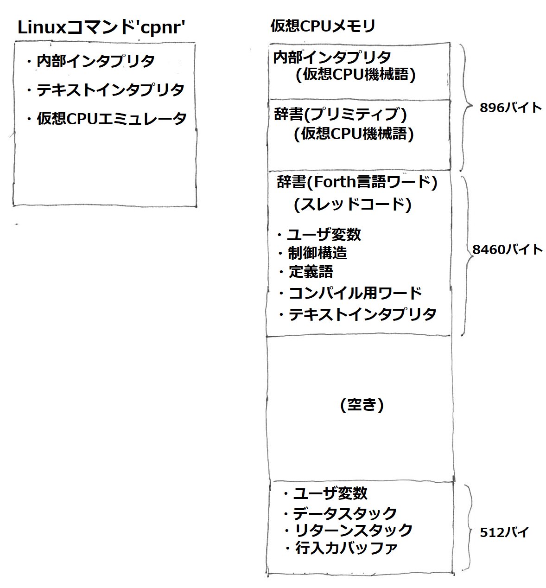

# CPNR, A C Portable NarrowRoad Forth interpreter

本リポジトリは、C言語で動くForthインタプリタ"CPNR"を提供します。

テキストインタプリタとスレッドコードインタプリタ(内部インタプリタ)をC言語で記述したコマンド(実行可能形式)に、最低限の機械語ワードを含む辞書を与えて起動し、Forthのコロン定義で記述したワードを辞書に追加してForth処理系を完成させます。

この処理系は、C言語で記述された「仮想CPU」により実行されます。「仮想CPU」の命令セットはForth処理に特化しており、普通のCPUの機械語「らしくない」ものです。超多機能の1ワード命令主体で、レジスタを生かしたメモリアクセスがありません。

レトロCPUを含むさまざまなマイコンに短時間で移植できるように、機械語依存部分を最小限として、ここのみを書き換えて新しいCPU上で動作するForth処理系を作ることができます(できるはずです……鋭意開発進行中)。

ワード揃えは、過去に存在したForth標準規格に準拠していませんが、ユーザ変数、制御構造、定義語、コンパイル、テキストインタプリタを構成できるところまではそろえてあります。但し、Forth処理系なら普通に持っている、「エディタ」「アセンブラ」「2次記憶サポート(仮想メモリ)」はサポートしていません。

ターゲット開発環境でC言語が使用できるのならば、ターゲットハード/CPUが持つI/O、周辺機器を制御するプリミティブをC言語で記述し、C言語main関数の中から本処理系を呼び出して、それらプリミティブと組み合わせればよいだろうという考えに基づきます。

ソースコードライセンスはBSD-3clauseとします。

* [動機](./MOTIVATION.md)
* [仮想CPUレジスタ・命令表](./VIRTUALCPU.md)
* [ワード仕様](SPECS.md)

## システム概要

<figure>

<figcaption>図1. システム概要
</figure>

C言語版テキストインタプリタと仮想CPU実行器が、メモリ中のバイト配列上に配置した仮想CPU機械語を実行します。

Cソースコードはコンパイルされ、Linuxコマンド`cpnr`が生成されます。

仮想CPU機械語で書かれた部分は、仮想CPU用アセンブリ言語で記述され、アセンブル後イメージファイルに変換され、`cpnr` 起動時に引数で指定します。

また、Forth言語ワードを定義するソースファイルも合わせて引数で指定します。この状態で`cpnr`を呼び出すと、Forth処理系がスタートします。

## ビルド方法

リポジトリ`https://github.com/tendai22/cpnr.git`を`clone`したのちに、`cpnr/src`に`cd`してから、(`git checkout RC`してから) `make`コマンドを実行してください。

> GNU make/GNU awk前提となってしまっています。申し訳ないです。  
> FreeBSDユーザは、gmake/gawkをインストールしてから、`gmake`コマンドでビルドしてください。

```shell
kuma@LizNoir:~/temp$ git clone https://github.com/tendai22/cpnr.git
Cloning into 'cpnr'...
remote: Enumerating objects: 1224, done.
remote: Counting objects: 100% (441/441), done.
remote: Compressing objects: 100% (288/288), done.
remote: Total 1224 (delta 305), reused 284 (delta 152), pack-reused 783
Receiving objects: 100% (1224/1224), 1.75 MiB | 1.37 MiB/s, done.
Resolving deltas: 100% (914/914), done.
kuma@LizNoir:~/temp$ cd cpnr
kuma@LizNoir:~/temp/temp/cpnr$ git checkout RC
Branch 'RC' set up to track remote branch 'RC' from 'origin'.
Switched to a new branch 'RC'
kuma@LizNoir:~/temp/cpnr$ cd src
kuma@LizNoir:~/temp/cpnr/src$ make
sh makeuser.sh -h 0x8000 0xf000 user.def > user.h
cc -g -Wno-pointer-sign    -c -o main.o main.c
cc -g -Wno-pointer-sign    -c -o machine.o machine.c
sh makeopcode.sh machine.h opcode.c > opcode.inc
sh gen_opname.sh opcode.inc > opname.h
cc -g -Wno-pointer-sign    -c -o monitor.o monitor.c
cc -g -Wno-pointer-sign    -c -o cfunc.o cfunc.c
cc -g -Wno-pointer-sign    -c -o opcode.o opcode.c
cc -g -Wno-pointer-sign    -c -o key_linux.o key_linux.c
cc -g -Wno-pointer-sign  -o cpnr main.o machine.o monitor.o cfunc.o opcode.o key_linux.o
sh makeuser.sh -f 0x8000 0xf000 user.def > user.f
sh makeuser.sh -s 0x8000 0xf000 user.def > user.s
sh makedict.sh primary.dict > primary.s
cat user.s inner.s primary.s > dict.s
sh as.sh dict.s > dict.list
.equ entry_head=entry_056
.equ entry_head=entry_056
sh dump.sh dict.list > dict.X
./cpnr -o self8.bin dict.X user.f base.f cold.f dictdump.f
dict.X: read_xfile
read_xfile: offset = 0000
init_org: org_addr = 8000, user_org_addr = 0000
init_mem: org: 8000, dp: 8380, last: 8372
init_mem: up: f000, s0: f100, r0: f200, tib: f100
start text interpreter
open: user.f
open: base.f

End: A45E, 245E(9310 ) bytes.
open: cold.f
open: dictdump.f
m_dictdump: begin: 8000, end: a48c, last: a47c
savefile: self8.bin, 9356 bytes
bye
abort result = -1
kuma@LizNoir:~/temp/cpnr/src$
```

## お試し方法

全部入りの辞書イメージ`self8.bin`が生成されているはずですので、それを使ってForth処理系を起動します。簡単なワードを`add_one`を定義して実行します。

```
kuma@LizNoir:~/temp/cpnr/src$ ./cpnr self8.bin
self8.bin: dicttop = 8000, dp = a48c, last = a47c
init_org: org_addr = 8000, user_org_addr = f000
init_mem: org: 8000, dp: a48c, last: a47c
init_mem: up: f000, s0: f100, r0: f200, tib: f100
start cold at a484

narrowForth v0.91dev
[] OK : add_one 1 + ;
[] OK 1
[0001 ] OK add_one
[0002 ] OK add_one
[0003 ] OK trap: result = -1, lnum = 0
kuma@LizNoir:~/temp/cpnr/src$
```

レトロCPU界隈で人気のASCIIART(マンデルブロ図形)も実行できます。`self8.bin`を使わずにプリミティブ辞書とソースコードを引数で指定してインタプリタを起動して、ワード`asciiart`を叩いてください。

```
kuma@LizNoir:~/temp/cpnr/src$ ./cpnr dict.X user.f base.f asciiart.f
dict.X: read_xfile
read_xfile: offset = 0000
init_org: org_addr = 8000, user_org_addr = 0000
init_mem: org: 8000, dp: 8380, last: 8372
init_mem: up: f000, s0: f100, r0: f200, tib: f100
start text interpreter
open: user.f
open: base.f

End: A45E, 245E(9310 ) bytes.
open: asciiart.f

[][] ok
asciiart
0000001111111111111111111111222222222333334568BC6744332222221111111111100000000
000000011111111111111111111122222222233344598C  7794333322222111111111000000000
0000000011111111111111112222222233324444556       95543333221111111110000000000
0000000011111111111211112222222333455665778       97655444422221111110000000000
000001111111111112222222233333334457 AB9              787B543211111111110000000
000111111111112222222222333333444667                       53222211111111100000
000011111111111222333444444444555A                       9644332221111111000000
000001111112222223345D6657 6555679                        AA4332221111111000000
0000112222222233334569  8C  E8789                          B4332211111111000000
1111112222223333345578D        E                            4332221111111111110
11111222333344444789A                                      54332211111111111110
11112233445555658A                                       C643322222211111111110
11112                                                   97544332222111111111110
11112233445555658A                                       C643322222211111111110
11111222333344444789A                                      54332211111111111110
1111112222223333345578D        E                            4332221111111111110
0000112222222233334569  8C  E8789                          B4332211111111000000
000001111112222223345D6657 6555679                        AA4332221111111000000
000011111111111222333444444444555A                       9644332221111111000000
000111111111112222222222333333444667                       53222211111111100000
000001111111111112222222233333334457 AB9              787B543211111111110000000
0000000011111111111211112222222333455665778       97655444422221111110000000000
0000000011111111111111112222222233324444556       95543333221111111110000000000
000000011111111111111111111122222222233344598C  7794333322222111111111000000000
0000001111111111111111111111222222222333334568BC6744332222221111111111100000000
[][] ok
bye
bye
abort result = -1
kuma@LizNoir:~/temp/temp/cpnr/src$
```

* ソースコードは `src`の下にあります。
* ビルドは`src`の下で`make`コマンドを実行すればOKです。シェルスクリプト実行が必須ですので、Linux/Unix環境でお試しください。
* `gawk`/`gmake` 前提となってしまいました。申し訳ないです。FreeBSD上では、`gmake`/`gawk`をインストールしてからビルドしてください。
* 実行はコマンド`cpnr`を起動してください

```
NAME
    cpnr - A Forth interpreter-kit for porting new CPUs

SYNOPSIS
    cpnr [-o DICTDUMP-FILE] DICT-FILE FILE...

DESCRIPTION
    A forth interpreter writtend C.

    It start with very limited definitions, including inner/outer 
    interpreter, definitions of `:`(colon), `;` and some dictionary
    handling words.

    files are interpreted in turn, usually the first argument file, 
    DICT-FILE specify a meaningful forth word definitions.  After 
    parsing(read and compile all of these *.f source file), all of
    the argument files, it enters an outer interpreter prompted with
    " ok".

    The option '-o' specifies an output filename, DICTDUMP-FILE for 
    dumping the latest dist image. 

    More detail description, available words are specified 
    in SPECS.md'

```

# 参考文献

1. Loeliger, R G., *Threaded interpretive languages.*, 1981 BYTE Publications Inc.

